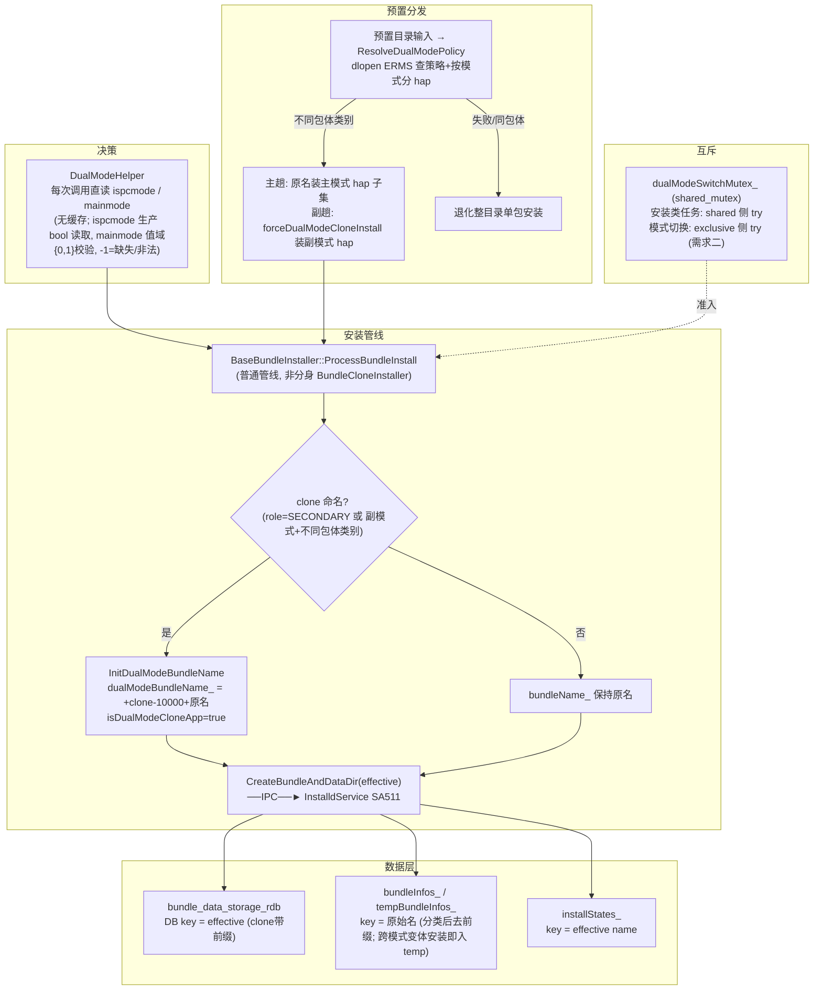
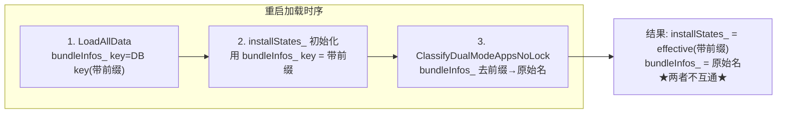
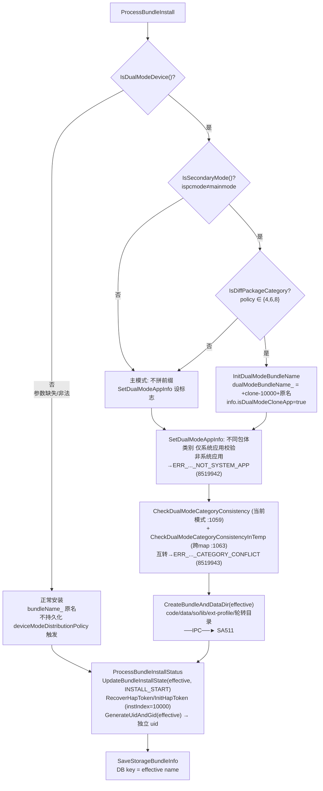
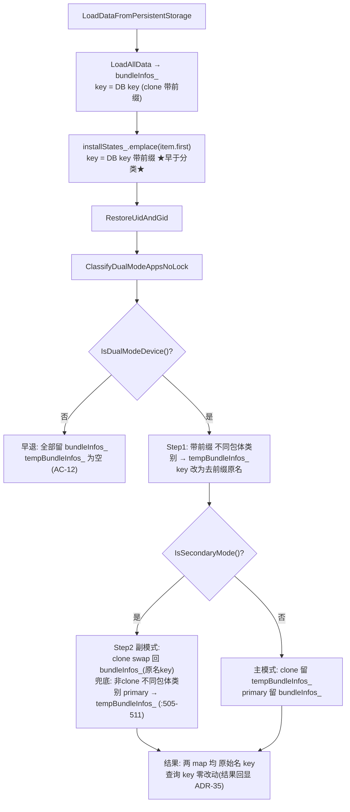
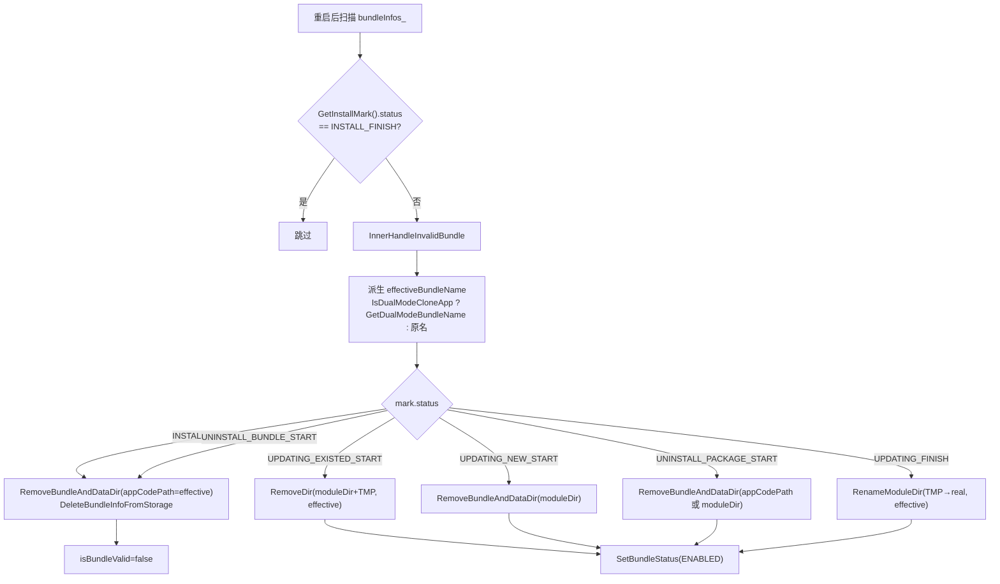
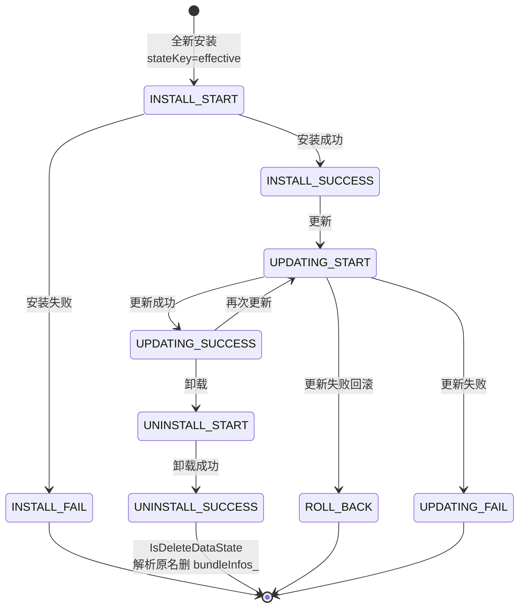
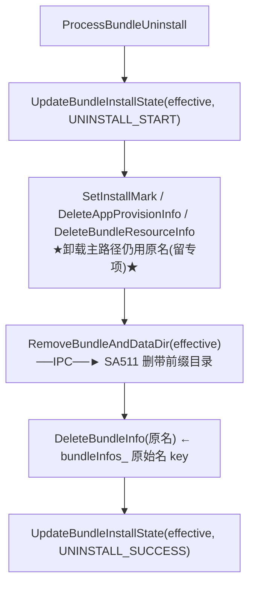

# 架构设计

> 双模式同包名不同安装包应用安装支持。当前代码基线：`fix_dual_doc` HEAD `bcbfe06a9`。本文档行号引用基于该 HEAD，后续提交可能偏移。

## 设计元数据

| 字段 | 内容 |
|------|------|
| Design ID | DESIGN-20260715-001 |
| 关联需求 | [proposal.md](./proposal.md) |
| 关联 Epic | 无（独立特性） |
| 目标 Feature | FEAT-20260715-001 |
| 复杂度 | 标准 |
| 目标版本 | OpenHarmony-6.0-Release |
| Owner | [待确认] |
| 状态 | Approved |

## 核心概念

| 概念 | 含义 |
|------|------|
| 双模式设备 | `persist.sceneboard.ispcmode`（生产 **bool**：true=2in1/false=tablet）存在且 `const.sceneboard.mainmode`（int）合法 ∈{0,1}；两参数归一化后以 0=tablet、1=2in1 参与判定 |
| 主模式 | `ispcmode == mainmode`（当前模式即主模式） |
| 副模式 | `ispcmode != mainmode`（当前模式为非主模式） |
| 不同包体类别（DiffPackage） | `DeviceModeDistributionPolicy` ∈ {`UNIVERSAL_DIFFERENT_PACKAGE`(4), `PARTIAL_COMPATIBLE_DIFFERENT_PACKAGE`(6), `FULL_COMPATIBLE_DIFFERENT_PACKAGE`(8)}，同包名不同包体，双模式特殊处理对象（`DualModeHelper::IsDiffPackageCategory` 判定为 true） |
| dual-mode clone app | 副模式安装的不同包体类别 应用，`InnerBundleInfo.isDualModeCloneApp=true`，`appIndex=DUAL_MODE_CLONE_APP_INDEX(10000)`（由 `SetDualModeAppInfo` 置位） |
| effective name | clone app 的带前缀标识 `+clone-10000+{bundleName}`，用于目录/DB key/状态机 |
| 原始名 | `bundleName` 本身（不带前缀），用于查询/事件/odid/日志 |

## 需求基线

> 需求基线详见 proposal.md。以下仅列出设计阶段需额外强调的约束。

| 项 | 补充说明 |
|----|----------|
| 前缀机制定位 | 副模式不同包体类别应用**走普通安装管线**（BaseBundleInstaller），非分身管线（BundleCloneInstaller）；仅在 bundleName 上拼接 `+clone-10000+` 前缀 |
| appIndex 固定 10000 | 不走分身 appIndex 分配（1..5），不触发 `VerifyAndAckCloneAppIndex`；普通安装路径无 `IsValidAppIndex(10000)` 校验 |
| odid 一致性 | `GenerateOdidNoLock` 基于 developerId 的 groupId 派生（非 bundleName），同时遍历 `bundleInfos_` + `tempBundleInfos_`，同应用主/副模式 developerId 相同 → 一致性保持 |
| key 自愈陷阱 | `bundle_data_storage_rdb.cpp` 的 `TransResult`/`UpdateDataBase` 会重写 `key != GetBundleName()` 的记录，是前缀方案的核心风险点（ADR-3 处理） |
| 模式判断参数 | `persist.sceneboard.ispcmode`（生产 **bool**：true=2in1/false=tablet，缺失即无效）+ `const.sceneboard.mainmode`(int 0/1)；任一无效 → 非双模式设备 |

## 上下文和现状

### 涉及仓和模块

| 仓库 | 补充架构说明 |
|------|-------------|
| bundlemanager_bundle_framework | 单仓内多模块改造。特权文件操作一律跨 IPC 到 installd 进程（SA 511），BMS 主进程不直接操作文件系统。ApplicationInfo/InstallParam 在 `interfaces/inner_api/appexecfwk_base`，属跨进程传递的结构，IPC Parcel 与 JSON 持久化双轨 |

### 适用架构规则

| Rule ID | 适用原因 | 设计结论 | 验证方式 |
|---------|----------|----------|----------|
| OH-ARCH-LAYERING | 框架层（BMS）经 IPC 调服务层（installd） | 安装流程在 BMS 组织，目录/权限操作经 InstalldClient→SA511 | 代码评审/集成测试 |
| OH-ARCH-IPC-SAF | InstallParam 跨 IPC 传递 | deviceModeDistributionPolicy 必须加入 Parcel 序列化（ReadFromParcel+Marshalling） | 单测 |
| OH-ARCH-API-LEVEL | 新增 Public API | BundleInfo.deviceModeDistributionPolicy / InstallParam.deviceModeDistributionPolicy / DeviceModeDistributionPolicy，需 SysCap 声明 | API 评审/XTS |
| OH-ARCH-API-LEVEL | 新增 Public API | BundleInfo.appSandboxPolicy / AppSandboxPolicy（SHARED_SANDBOX=0 / ISOLATED_SANDBOX=1），需 SysCap 声明 | API 评审/XTS |
| OH-ARCH-ERROR-LOG | 不同包体类别互转/非系统应用安装失败需错误码 | 新增专用错误码 `ERR_APPEXECFWK_INSTALL_DUAL_MODE_CATEGORY_CONFLICT`(8519943) / `ERR_APPEXECFWK_INSTALL_DUAL_MODE_NOT_SYSTEM_APP`(8519942) | hilog/单测 |
| OH-ARCH-COMPONENT-BUILD | 无新增部件 | 仅现有模块修改，BUILD.gn 无需改动（新增源文件需加入对应 target） | 构建验证 |

### 不涉及项承接

| 维度 | 设计结论 |
|------|----------|
| 兼容性（涉及） | ApplicationInfo/InstallParam 新增字段带默认值（UNSPECIFIED=0）；`from_json` 找不到 key 回退默认值机制天然兼容存量（AC-18），零迁移 |
| API/SDK（涉及） | 3 个 Public 增量：见「API 签名」节；枚举为连续 int 值（0~8），不支持按位或 |
| IPC/跨进程（涉及） | InstallParam.deviceModeDistributionPolicy 经 Parcel 跨进程；目录/轮转操作经 InstalldClient（SA 511） |

## 总体方案设计

### 总体架构



**核心选择（ADR-1）**：clone app 走**普通安装管线** + bundleName 前缀，而非分身管线（分身是"共享代码目录+独立数据目录"，双模式是"独立包体+独立目录"，语义不符）。

### 核心机制

**模式判断 — DualModeHelper（ADR-5/10）**：每次调用直读系统参数（无进程级缓存）。ispcmode 生产 key 为 **bool** 类型，经 `ReadValidIspcmodeParam`（dual_mode_helper.cpp:86-99）双路径读取：生产 key 先 `GetParameter(key, "")` 判存在（空串→-1），再 `GetBoolParameter`（true→2in1(1) / false→tablet(0)）；测试 key（`persist.bms.ispcmode`）为 int，走 `ReadValidModeParam`（`GetIntParameter(key, -1)` 以 -1 作"参数不存在/读取失败"sentinel 再校验值域 ∈{0,1}）。mainmode 两种 key 均为 int，走 `ReadValidModeParam`。对外归一化后均为 0/1/-1：

```
IsDualModeDevice() = (ispcmode ∈ {0,1} && mainmode ∈ {0,1})      // 每次直读两参数
IsSecondaryMode()  = IsDualModeDevice() && ispcmode != mainmode  // 每次直读
GetSysMode()       = 直读 ispcmode（生产 bool 归一化），0=tablet / 1=2in1 / -1=缺失或非法
GetMainmode()      = 直读 const.sceneboard.mainmode，0/1/-1      // 预置 fan-out 区分主模式 deviceType
```

任一参数无效（ispcmode 生产 bool 仅"缺失"一种无效态；mainmode 缺失/非法 ∉{0,1}）→ 非双模式设备 → 完全回退正常流程（AC-3/AC-12/AC-33）；直读保证模式切换后安装侧判定即时生效（与需求二切换后状态一致，无缓存刷新问题）。测试注入开关（ADR-22）：`IsTestDualMode()` 读 `persist.bms.test_dual_mode`，为 true 时改读 `persist.bms.ispcmode`（int 0/1） / `persist.bms.mainmode`，与生产 bool key 的差异在 `ReadValidIspcmodeParam` 内分流（生产零影响）。

**预置分发 — ResolveDualModePolicy + 两趟 fan-out（ADR-32）**：预置目录输入时经 ERMS（dlopen `liberms_sdk.z.so`）解析分发策略与按 deviceType 分组的 hap 清单；不同包体类别拆主趟（原名、免二次验签）+ 副趟（clone 前缀名）安装，`dualModeInstallRole_`（NONE/PRIMARY/SECONDARY）驱动 clone 命名与跨模式存储判定（`ShouldUseDualModeCloneName` / `IsCrossModeInstall`）。

**操作互斥 — dualModeSwitchMutex_（ADR-34）**：安装/更新/卸载任务持共享侧（try，不等待），模式切换持排他侧（需求二）；切换进行中安装类任务快速失败 8519944，非双模式设备全程不触锁。

**查询回显 — clone 记录结果 appIndex 恒 10000（ADR-35）**：查询 key 仍为原始名（ADR-4 不变），仅结果 payload 回显 clone 身份——`AbilityInfo` / `ExtensionAbilityInfo` / `ShortcutInfo` 的 `appIndex` 经 `InnerBundleInfo::ResolveDualModeResponseAppIndex` 对 clone 记录恒返 10000（与 ADR-28 info 字段同源），shortcut 可见性行读写按 10000 解析；非 clone 记录原样透传请求值。

**标识字段 — isDualModeCloneApp（ADR-9）**：`InnerBundleInfo` 新增 `bool isDualModeCloneApp_`（默认 false，Parcel/JSON 向后兼容）。安装时副模式不同包体类别置 true；存储按字段定 DB key；加载用 DB 原始 key 保留主副两条；分类按字段+模式分入两 map。该字段是持久化标识，cross-flow 调用方（卸载/恢复的新 installer 实例）也能准确判定。

**effective name（ADR-14）**：

```cpp
// 无参：install/update 主流程（dualModeBundleName_ 已设）
return dualModeBundleName_.empty() ? bundleName_ : dualModeBundleName_;

// 带参：卸载/恢复等新实例（dualModeBundleName_ 未设），info-driven
return bundleInfo.IsDualModeCloneApp()
    ? DualModeHelper::GetDualModeBundleName(bundleInfo.GetBundleName())
    : bundleInfo.GetBundleName();
```

**规则**：目录/DB key/状态机用 effective name；日志/事件/odid/查询用原始名。

**不同包体类别判定**：`DualModeHelper::IsDiffPackageCategory(policy)` 判定 `policy ∈ {UNIVERSAL_DIFFERENT_PACKAGE(4), PARTIAL_COMPATIBLE_DIFFERENT_PACKAGE(6), FULL_COMPATIBLE_DIFFERENT_PACKAGE(8)}`。枚举为连续 int 值、不支持按位或，用枚举值集合判定（详见「数据模型」枚举定义）。

### 隔离维度全景

| 维度 | 机制 | ADR |
|------|------|-----|
| 安装目录 / 数据目录 / 轮转目录 | effective name 作叶子名（`+clone-10000+`） | ADR-1/14 |
| DB 持久化 key | `installed_bundle` 表 key = effective name | ADR-2/9 |
| 内存查询 map | `bundleInfos_`（当前模式）/ `tempBundleInfos_`（另一模式），均原始名 key | ADR-4 |
| 运行时状态机 | `installStates_` key = effective name | ADR-21 |
| HAP 权限 token | `instIndex=10000` 生成独立 hap token | ADR-11 |
| 数据目录 uid | 带前缀名派生独立 bundleId → 独立 uid（持久化） | ADR-13 |
| odid | 跨模式按 developerId 复用（遍历 bundleInfos_ + tempBundleInfos_） | ADR-7 |
| 异常恢复 | 目录用 effective、查询用原名（反向解析） | ADR-15 |

## 关键设计决策

### ADR-1：副模式不同包体类别应用走普通安装管线 + bundleName 前缀（非分身管线）

| 字段 | 内容 |
|------|------|
| 问题 | 副模式不同包体类别应用如何安装隔离？复用分身管线还是普通管线？ |
| 推荐方案 | 走普通安装管线（BaseBundleInstaller），在 bundleName_ 确定后、创建目录前，对副模式不同包体类别应用的 bundleName 拼接 `+clone-10000+` 前缀 |
| 取舍理由 | 普通管线 + 前缀改动最局部；目录命名用 bundleName 直接做叶子名，传入带前缀名自然得到带前缀目录；+new-/+old- 轮转透传 bundleName 自动正确。放弃①复用 BundleCloneInstaller 分身管线（分身是"共享代码目录+独立数据目录"，双模式是"独立包体+独立目录"，语义不符）；放弃②独立 userId 隔离（userId 维度改动影响面巨大） |
| 影响 | `ProcessBundleInstall` 中 bundleName_ 确定后插入前缀处理逻辑（封装为 `InitDualModeBundleName`） |

### ADR-2：DB key 格式采用 `+clone-10000+{bundleName}`（与目录名一致）

| 字段 | 内容 |
|------|------|
| 问题 | 副模式不同包体类别应用的数据库 key 用哪种格式？ |
| 推荐方案 | `+clone-10000+{bundleName}`，与目录名、内存 map key 三处统一格式 |
| 取舍理由 | 目录、DB key、内存 key 三处格式统一，降低维护成本；前缀可逆可解析（复用 ParseCloneDataDir）。放弃分身 DB key 格式 `{appIndex}clone_{bundleName}`（与目录名不一致，易混淆） |
| 影响 | 需处理 key 自愈陷阱（ADR-3）；内存 map `bundleInfos_` key 也用带前缀名（分类后去前缀，见 ADR-4） |

### ADR-3：key 自愈陷阱解决方案——扩展 InnerBundleInfo 携带"存储 key"标识

| 字段 | 内容 |
|------|------|
| 问题 | `TransResult` 把 `key != GetBundleName()` 的记录当不一致重写，会误删副模式前缀 key |
| 推荐方案 | 副模式记录在内存与持久化中由 `InnerBundleInfo.isDualModeCloneApp_` 字段标识（ADR-9）；存储层按该字段决定 DB key（true→带前缀，false→原名）；`TransResult`/`UpdateDataBase` 对以 `+clone-` 开头的 key 跳过"按 GetBundleName 重写"的自愈逻辑 |
| 取舍理由 | 最小侵入；保留 GetBundleName() 语义不变；仅在前缀 key 这一窄场景跳过自愈。放弃让 GetBundleName() 直接返回带前缀名（污染事件/odid/查询等大量调用点）；放弃完全关闭自愈（影响其他正常场景） |
| 影响 | `bundle_data_storage_rdb.cpp` 的 `TransResult`/`UpdateDataBase` 识别 `+clone-` 前缀 |

### ADR-4：查询策略——加载时去前缀 + 双 map（bundleInfos_ / tempBundleInfos_），查询不改 key

| 字段 | 内容 |
|------|------|
| 问题 | 副模式查询不同包体类别应用时，是改查询 key 为带前缀，还是加载时去前缀？ |
| 推荐方案 | 加载时去前缀。副模式不同包体类别应用加载后以**去前缀的原始 bundleName** 放入 `bundleInfos_`（当前模式可查询）；主模式下放入 `tempBundleInfos_`。查询接口不变，始终用原始 bundleName 查 |
| 取舍理由 | 查询侧 key 零改动（查询结果 payload 对 clone 记录回显 appIndex=10000，见 ADR-35），模式差异集中在加载阶段；模式切换（需求二）只需在两个 map 间移动条目。放弃查询时按模式改 key（查询点分散且多，易遗漏） |
| 影响 | `LoadDataFromPersistentStorage` 步骤 3 后新增分类逻辑（`ClassifyDualModeAppsNoLock`）；新增 tempBundleInfos_ 成员 |
| 边界补强 | `ClassifyDualModeAppsNoLock` 副模式分支：若某不同包体类别应用**仅有 primary 变体（无 clone 对应）**，swap 逻辑会跳过它致其残留 bundleInfos_ 被错误查询；新增兜底遍历（bundle_data_mgr.cpp:505-511）将所有 `IsDiffPackageCategory && !IsDualModeCloneApp` 的条目从 bundleInfos_ 移入 tempBundleInfos_，确保副模式下 bundleInfos_ 仅保留 clone |

> DB 存储仍用带前缀 key（ADR-2），仅"加载到内存 map 时"去前缀。DB key（带前缀）↔ 内存 key（去前缀）转换发生在加载/存储边界。

### ADR-5：主副模式判断封装为 DualModeHelper 工具类

| 字段 | 内容 |
|------|------|
| 问题 | persist.sceneboard.ispcmode / mainmode 读取 + 主副模式判断逻辑放哪里？ |
| 推荐方案 | 新建 `DualModeHelper`，封装：①读 ispcmode（生产 bool：true=2in1/false=tablet，归一化 0=tablet/1=2in1）+ mainmode(0=主tablet/1=主2in1 int) 两个参数并归一化校验；②判断主/副模式（`IsDualModeDevice=(ispcmode∈{0,1} && mainmode∈{0,1})`，`IsSecondaryMode=IsDualModeDevice && ispcmode≠mainmode`）；③判断设备模式分发策略是否需特殊处理；④前缀生成/解析 |
| 取舍理由 | 集中管理模式判断，便于测试与维护；两 int 参数直接表达"当前模式/主模式"，无需设备类型反推。放弃内联到安装流程各处（多处复用导致重复） |
| 影响 | 安装流程、加载流程均调用；对外签名不变（仅内部实现），零调用方改动 |

### ADR-6：appIndex=10000 常量与校验绕过

| 字段 | 内容 |
|------|------|
| 问题 | appIndex 固定 10000，但 IsValidAppIndex 上限是 GetCloneMaxCount(=5)，如何避免误拦？ |
| 推荐方案 | 常量 `DUAL_MODE_CLONE_APP_INDEX = 10000`（bundle_service_constants.h:254）；双模式走普通安装路径（BaseBundleInstaller）不调用 IsValidAppIndex，分身路径（BundleCloneInstaller）才调用 |
| 取舍理由 | 双模式与分身是不同管线，校验不交叉；通过常量集中管理 10000。放弃修改 IsValidAppIndex 放宽上限（会放行非法分身 appIndex） |
| 影响 | 新增常量；代码评审确认无普通安装路径意外触发 IsValidAppIndex(10000) |

### ADR-7：odid 一致性——GenerateOdidNoLock 遍历 bundleInfos_ + tempBundleInfos_

| 字段 | 内容 |
|------|------|
| 问题 | 如何保证跨模式 odid 一致（AC-16）？ |
| 推荐方案 | `GenerateOdidNoLock`（bundle_data_mgr.cpp:12959）按 developerId 的 groupId 复用 odid：同应用主/副模式 developerId 相同 → groupId 相同 → 复用同一 odid。复用查找需**同时遍历 `bundleInfos_` 与 `tempBundleInfos_`**（:12988/:12990），因为副模式下主模式变体被 `ClassifyDualModeAppsNoLock` 移入 `tempBundleInfos_`（AC-14），仅遍历 `bundleInfos_` 会漏掉它 |
| 取舍理由 | groupId 复用是 odid 的既有语义；扩大查找范围到 tempBundleInfos_ 最小侵入（只读遍历、同 `bundleInfoMutex_` 锁保护），非双模式 tempBundleInfos_ 为空零影响 |
| 影响 | `GenerateOdidNoLock` +遍历 tempBundleInfos_（3 个调用点自动受益） |

### ADR-8：DeviceModeDistributionPolicy 枚举设计（连续 int 值，不支持按位或）

| 字段 | 内容 |
|------|------|
| 问题 | 设备模式分发策略枚举值如何定义？需表达"模式分发 + 兼容性 + 包体异同"三轴，且策略互斥 |
| 推荐方案 | 枚举类型 `DeviceModeDistributionPolicy`（底层 `int32_t`），9 个成员取连续整数值 0~8：`UNSPECIFIED`=0（默认，不区分）、`MAIN_ONLY`=1（仅主模式）、`SUB_ONLY`=2（仅副模式）、`UNIVERSAL_IDENTICAL_PACKAGE`=3（通用·相同包体）、`UNIVERSAL_DIFFERENT_PACKAGE`=4（通用·不同包体）、`PARTIAL_COMPATIBLE_IDENTICAL_PACKAGE`=5（部分兼容·相同包体）、`PARTIAL_COMPATIBLE_DIFFERENT_PACKAGE`=6（部分兼容·不同包体）、`FULL_COMPATIBLE_IDENTICAL_PACKAGE`=7（完全兼容·相同包体）、`FULL_COMPATIBLE_DIFFERENT_PACKAGE`=8（完全兼容·不同包体）。成员名采用**无前缀短名**（依赖 `enum class` 作用域区分） |
| 取舍理由 | 语义为"模式分发策略 + 兼容性维度 + 包体异同维度"三轴组合，策略互斥，连续整数 0~8 天然表达，不采用按位或组合；`*_DIFFERENT_PACKAGE` 三个值（4/6/8）即"不同包体类别"，统一由 `IsDiffPackageCategory` 判定触发副模式隔离；`*_IDENTICAL_PACKAGE` 三个值（3/5/7）为同包体共享，不触发隔离；`MAIN_ONLY`/`SUB_ONLY`（1/2）为单模式独有，不触发隔离；`IsDiffPackageCategory` 用集合判定 `policy ∈ {4,6,8}` |
| 影响 | ①枚举类型 `DeviceModeDistributionPolicy`（9 成员、连续 int 0~8、`int32_t`）；②字段 `deviceModeDistributionPolicy`，访问器 `Get/SetDeviceModeDistributionPolicy`；③`IsDiffPackageCategory` 用枚举值集合判定 `policy ∈ {4,6,8}`（5 个调用点）；④事件 Want 字段 key 为 `"deviceModeDistributionPolicy"`（须同步需求二上层消费者）；⑤"不同包体类别"即 `*_DIFFERENT_PACKAGE`（4/6/8）；⑥枚举定义位于 `bundle_info.h`、字段位于 `BundleInfo`（`InnerBundleInfo` Get/Set 经 `baseBundleInfo_`），`InstallParam` 字段保留；⑦NAPI 运行时注册 9 个命名值（ADR-36），JS 侧 `bundleManager.DeviceModeDistributionPolicy.*` 可用 |

### ADR-9：副模式应用标识字段 isDualModeCloneApp

| 字段 | 内容 |
|------|------|
| 问题 | 如何在 DB key 带前缀实现持久层隔离的同时，让加载分类能识别副模式不同包体类别应用、把主副同名记录分别放入 bundleInfos_/tempBundleInfos_ 而不冲突？ |
| 推荐方案 | InnerBundleInfo 新增 `bool isDualModeCloneApp_`（默认 false，Parcel/JSON 向后兼容）。①安装：副模式不同包体类别安装时置 true；②存储：按该字段决定 DB key（true→带前缀，false→原名）；③加载：TransResult 的 validInfos 用 DB 原始 key 做 key（保留主副两条不丢）；④分类：按 `IsDualModeCloneApp()` + 当前模式，去前缀原名分入 bundleInfos_/tempBundleInfos_ |
| 取舍理由 | 字段在 InnerBundleInfo 内显式标识，不依赖 key 前缀推断；与 DB key 前缀（持久隔离）、加载 validInfos 用 DB 原始 key（保留主副两条）三者协同；分类后 bundleInfos_/tempBundleInfos_ 恢复原名 key，查询 key 零改动（结果 payload 回显 clone appIndex 见 ADR-35）。放弃纯 DB key 前缀判断（加载阶段前缀丢失，判断无依据）；放弃 bundleName 直接存带前缀（破坏查询路径） |
| 影响 | InnerBundleInfo 新增字段 + Parcel/JSON 序列化（向后兼容）；存储层 key 按字段定前缀；加载 validInfos key 用 DB 原始 key；分类用字段判断 |

### ADR-10：DualModeHelper 模式判断直读系统参数（无缓存）

| 字段 | 内容 |
|------|------|
| 问题 | ispcmode / mainmode 在安装/加载/查询/互斥准入多处被读取，读一次入进程缓存还是每次实时读？ |
| 推荐方案 | `IsDualModeDevice()` / `IsSecondaryMode()` / `GetSysMode()` / `GetMainmode()` 每次调用直读系统参数，DualModeHelper 不维护任何模式缓存成员。ispcmode 经 `ReadValidIspcmodeParam`（dual_mode_helper.cpp:86-99）双路径：生产 key（bool）先 `GetParameter(key, "")` 判存在（缺失→-1）再 `GetBoolParameter`（true→1(2in1) / false→0(tablet)）；测试 key（int）走 `ReadValidModeParam`。mainmode 经 `ReadValidModeParam`（:73-81，`GetIntParameter(key, -1)` -1 sentinel + 值域 ∈{0,1} 校验） |
| 取舍理由 | ①模式切换（需求二）后安装侧判定即时生效，无"缓存陈旧 vs 参数已变"一致性窗口，也不需要切换侧显式刷新钩子；②`GetSysMode`（事件 currentMode 字段）本就要求实时值，与其余判断同源直读消除双轨；③系统参数读取为内核 parameters 节点读取，开销可接受（安装路径调用频度低，非每查询热点）。放弃进程启动一次性缓存 + 切换时显式刷新（引入缓存失效时序问题：切换写参数与 BMS 读缓存之间任何失配都会造成安装归类错判，且需跨需求二的刷新契约） |
| 影响 | 判定语义不变（任一参数无效 → 非双模式设备回退正常流程，AC-3/AC-12/AC-33；生产 ispcmode 为 bool，仅"缺失"一种无效态；mainmode 缺失/非法 ∉{0,1} 均无效）；-1 sentinel 使"参数缺失"与"参数非法"统一回退；测试注入（ADR-22）改为设置 `persist.bms.ispcmode`（int） / `persist.bms.mainmode` 参数即生效，无需触碰缓存内部 |

### ADR-11：双模式克隆应用权限 token 隔离（instIndex=10000）

| 字段 | 内容 |
|------|------|
| 问题 | 双模式克隆应用（isDualModeCloneApp=true）与主模式同名应用如何实现 HAP token / 权限隔离？ |
| 推荐方案 | `SetDualModeAppInfo`（base_bundle_installer.cpp:5998-6005）在 isCloneApp（副模式）分支内置 `info.SetAppIndex(DUAL_MODE_CLONE_APP_INDEX=10000)`（单一数据源，安装时一次置位，随 InnerBundleInfo 持久化）；`BundlePermissionMgr::CreateHapInfoParams`（bundle_permission_mgr.cpp:766）直接 `hapInfo.instIndex = innerBundleInfo.GetAppIndex()`，使克隆应用获得独立 HapInfoParams，生成独立 hap token |
| 取舍理由 | 与目录/DB key 的 `+clone-10000+` 前缀在权限层对齐：10000 统一标识双模式克隆实例，目录、存储、权限三处隔离语义一致。appIndex 单一数据源——安装时一次置位，所有消费方直接读 10000，消除「info=0 / token=10000」分裂模型与 `GetAppIndex()==0` 隐含假设，与 ADR-6「appIndex 固定 10000」前提对齐 |
| 影响 | `base_bundle_installer.cpp` SetDualModeAppInfo 新增 `SetAppIndex`；`bundle_permission_mgr.cpp` CreateHapInfoParams 直接传播 `GetAppIndex()`（净减代码，关联 AC-19/AC-38）。`IsValidAppIndex` 由 ADR-6 既定绕过（双模式走 BaseBundleInstaller 不触达 installd 校验）；`GetDualModeBundleName`（目录/DB key 前缀）用常量派生、不读 appIndex 字段，目录/key 行为不变 |

### ADR-12：不同包体类别一致性校验收敛到双模式设备

| 字段 | 内容 |
|------|------|
| 问题 | 更新时的「不同包体类别 ↔ 非不同包体类别 互转拦截」（AC-8）在所有设备都生效，还是仅双模式设备？ |
| 推荐方案 | `BaseBundleInstaller::CheckDualModeCategoryConsistency`（base_bundle_installer.cpp:6143-6157）入口先判 `!DualModeHelper::IsDualModeDevice()` → 直接返回 ERR_OK。不同包体类别互转拦截仅对双模式设备生效 |
| 取舍理由 | 校验作用域与特性作用域一致（仅双模式设备），避免在 default/手机等设备误拦合法更新 |
| 影响 | AC-8 前置条件「且当前为双模式设备」 |

### ADR-13：副模式独立 uid 隔离（基于带前缀名的 bundleId 分配）

| 字段 | 内容 |
|------|------|
| 问题 | 副模式不同包体类别应用如何实现 uid 隔离？ |
| 推荐方案 | 副模式安装时，`CreateBundleDataDir` / `ProcessAsanDirectory` 用带前缀 bundleName（`GetEffectiveBundleName`）调 `GenerateUidAndGid`——`bundleIdMap_` 按 bundleName 分配 bundleId，带前缀名被视为新应用，分配独立 bundleId，故 uid 与主模式（原名）不同。生成后**恢复 userInfo.bundleName 为原名**（仅 uid 持久化，带前缀名不入 userInfo）。重启后 `RestoreUidAndGid` 从持久化 uid 反算 bundleId 重建 `bundleIdMap_`，副模式应用用带前缀名作 map value，uid 跨重启稳定 |
| 取舍理由 | 复用现有 `bundleIdMap_` 机制，带前缀名天然产生独立 bundleId/uid，零新增数据结构；uid 持久化保证跨重启稳定；bundleName 不持久化带前缀保持查询路径不变 |
| 影响 | `base_bundle_installer.cpp` CreateBundleDataDir 的 uid 生成块、ProcessAsanDirectory；`bundle_data_mgr.cpp` RestoreUidAndGid（关联 AC-20） |

### ADR-14：effective name 统一适配策略（目录路径 + 跨场景判断）

| 字段 | 内容 |
|------|------|
| 问题 | code-dir 下众多子目录与轮转目录在安装/更新/卸载多流程被创建/清理/重命名，如何统一适配带前缀名而不遗漏？ |
| 推荐方案 | ①**统一入口**：函数内计算 `effectiveBundleName = GetEffectiveBundleName(info)` 一次复用；②**路径分层**：基于 `info.GetAppCodePath()` 的路径自动带前缀，手动拼接 code-dir 路径的点逐个改 effective；③**跨场景判断**：卸载/异常恢复等新 installer 实例（`dualModeBundleName_` 未初始化）场景，用持久化字段 `info.IsDualModeCloneApp()` + `DualModeHelper::GetDualModeBundleName` 构造带前缀名。`GetEffectiveBundleName()`（无参，base_bundle_installer.cpp:10297）：`dualModeBundleName_.empty() ? bundleName_ : dualModeBundleName_`；`GetEffectiveBundleName(info)`（:10302）：dualModeBundleName_ 优先，否则 info-driven |
| 取舍理由 | effective name 集中在目录操作边界，原名保留在标识/查询/事件。放弃全局替换 bundleName_→effective（原名语义被破坏）；放弃每点独立判断模式（分散易遗漏） |
| 影响 | `base_bundle_installer.cpp` 10+ 处目录/轮转函数；`ProcessBundleInstall` 内前缀初始化封装为 `InitDualModeBundleName`；`DeliveryProfileToCodeSign`（:8509-8536）投递名用 `dualModeBundleName_` 守卫 |

> 规则：日志/事件/odid 等非目录用途保持原名；仅目录路径与文件操作标识参数用 effective。

### ADR-15：install exception 反向解析（带前缀名 → 原名查询）

| 字段 | 内容 |
|------|------|
| 问题 | install exception 恢复（`InnerProcessNewToRealPath`）接收的 bundleName 可能是带前缀名，但 `FetchInnerBundleInfo` 用原名 key 查询，带前缀会查不到，如何对齐？ |
| 推荐方案 | 调用 `FetchInnerBundleInfo` 前，用 `DualModeHelper::IsDualModeCloneKey` 判断 + `ParseDualModeBundleName` 解析回原名，用原名查询；目录操作保持传入的带前缀名 |
| 取舍理由 | 反向解析只在 exception 恢复这一边界做，集中且最小 |
| 影响 | `install_exception_mgr.cpp` `InnerProcessNewToRealPath`；`bundle_exception_handler.cpp` `InnerHandleInvalidBundle`（:147-191）info-driven 派生 effectiveBundleName 驱动所有目录操作（修复 clone 异常恢复用原名误操作主模式目录）；`SetInstallMark` 入参用 effective（关联 AC-21） |

### ADR-16：Skills 安装目录双模式包名隔离（info-driven）

| 字段 | 内容 |
|------|------|
| 问题 | skills 安装目录的创建/提取/重命名/删除如何补齐 effective name 适配？ |
| 推荐方案 | skills 目录统一用 info-driven effective name：`info.IsDualModeCloneApp() ? DualModeHelper::GetDualModeBundleName(info.GetBundleName()) : info.GetBundleName()`。覆盖 `RemoveAppSkillsDir` 调用方、`FinalizeAppSkills` temp/real 目录拼接、`ProcessAppSkills` 的 `ExtractSkillsPackage` 入参（base_bundle_installer.cpp:3170/3334/3438/5441 等） |
| 取舍理由 | skills 目录操作点集中、info-driven 统一不增复杂度；`info.IsDualModeCloneApp()` 为持久化字段（ADR-9），安装/更新/卸载/异常恢复任意流程均准 |
| 影响 | 关联 AC-22 |

### ADR-17：SkillsDescriptionManager 数据层 effective name 对齐

| 字段 | 内容 |
|------|------|
| 问题 | skills description 数据层以 bundleName 作主键，删除/查询用原名导致副模式写得进、删不掉、查不到，如何对齐？ |
| 推荐方案 | 删除/查询统一用 effective name（与插入侧及目录层 ADR-16 口径一致）；**对外 `skillInfo.bundleName`（Parcelable）保持原名**，effective name 仅用于 RDB key 与 skill 文件路径 |
| 取舍理由 | effective name 口径与 ADR-14/16 一致，RDB schema 零改动（仅 key 值）；对外 Parcelable 契约不变。放弃 RDB schema 加列（无存量数据，key 值变化成本更低）；放弃 skillInfo.bundleName 改 effective（破坏调用方契约） |
| 影响 | `base_bundle_installer.cpp` 删除 3 处；`bundle_data_mgr.cpp` `GetSkillInfoWithFlags` 查询/skillPath 用 effective name（关联 AC-23） |

### ADR-18：AppProvisionInfo 数据层 effective name 对齐（插入+删除）

| 字段 | 内容 |
|------|------|
| 问题 | AppProvisionInfo 数据层以 bundleName 作主键，插入/删除全用原名导致主副同名互相覆盖，如何对齐？ |
| 推荐方案 | 插入+删除用 effective name：插入 `AddAppProvisionInfo(GetEffectiveBundleName())`（连带 SetSpecifiedDistributionType/SetAdditionalInfo）；删除用 `GetEffectiveBundleName(oldInfo)`（info-driven）。不改 HSP（:695，不涉双模式） |
| 取舍理由 | 插入+删除对齐 effective name 保证副模式 provision 正确写入且卸载无孤儿。查询转换见 ADR-19 |
| 影响 | `base_bundle_installer.cpp` 插入+删除 3 处（关联 AC-24） |

### ADR-19：getAppProvisionInfo 查询转换（IsDualModeCloneApp 判定 provisionKey）

| 字段 | 内容 |
|------|------|
| 问题 | 副模式 provision 以带前缀 effective name 作 RDB key 存入，`GetAppProvisionInfo`（:10719）find(原名) 命中后 Manager 查询用原名查不到副模式 provision，如何对齐？ |
| 推荐方案 | find(原名) 命中后用 `infoItem->second.IsDualModeCloneApp()` 判定 provisionKey：副模式 → `DualModeHelper::GetDualModeBundleName(bundleName)`（带前缀）；主模式/非双模式 → `bundleName`（原名）。返回值 `appProvisionInfo.bundleName` 保持原名 |
| 取舍理由 | `IsDualModeCloneApp` 为持久化字段，分类后仍准确标识 clone；provisionKey 由它派生，与 ADR-18 存储 key 精确对齐；集中单点所有调用方受益；主模式/非双模式零变化 |
| 影响 | `bundle_data_mgr.cpp` `GetAppProvisionInfo` 1 处（:10719，关联 AC-25）。范围仅 `getAppProvisionInfo`（单数）；`getAllAppProvisionInfo`/ProcessCertificate/GenerateSignatureInfo 同源未覆盖，留后续 |

### ADR-20：Router 数据层插入+删除+更新 effective name 对齐（查询遗留其他需求）

| 字段 | 内容 |
|------|------|
| 问题 | Router 数据层以 bundleName 作主键，插入/更新/删除全用原名导致主副同名互相覆盖，如何对齐？ |
| 推荐方案 | 插入+删除+更新用 effective name：接收 InnerBundleInfo 的用 `IsDualModeCloneApp()` 判定；字符串重载 find 后判定。**查询转换（ProcessBundleRouterMap）作为遗留问题，由后续其他需求解决** |
| 取舍理由 | 插入+删除+更新对齐保证副模式 router 正确写入且卸载/更新无孤儿。放弃一步到位含查询转换（查询涉及 plugin/shared 子查询，独立设计） |
| 影响 | `bundle_data_mgr.cpp` Insert/Update 3 处；`base_bundle_installer.cpp` DeleteRouterInfo 2 处（关联 AC-26）。**已知高风险遗留**：副模式应用启动路由断裂（routerMap 空），查询适配落地前不可用 |

### ADR-21：installStates_ 状态机 effective name 对齐（调用方传 + 删表）

| 字段 | 内容 |
|------|------|
| 问题 | `installStates_`（运行时安装状态机 map）key 体系：重启加载初始化用 DB 带前缀 key（早于分类），运行时入参用原名 → clone app find 落空、状态机失效，如何对齐？ |
| 推荐方案 | **调用方传 effective name + 删表 + 内部前缀解析**。①`UpdateBundleInstallState(bundleName, state, isKeepData)`（bundle_data_mgr.cpp:814）内部：stateKey = 传入名（clone 带前缀 / 非 clone 原名），直接 find/emplace/erase（:827/:830/:844）；`IsDualModeCloneKey(bundleName)` 解析前缀**仅用于** `IsDeleteDataState` 删 `bundleInfos_` 的原名转换（带前缀→`ParseDualModeBundleName` 解析原名）。②BaseBundleInstaller 各状态调用点（INSTALL_START/FAIL/SUCCESS、UPDATING_START/SUCCESS/FAIL、ROLL_BACK、UNINSTALL_START/SUCCESS）改传 `GetEffectiveBundleName()` / `GetEffectiveBundleName(info/oldInfo)`。③5 处查询点（AddInnerBundleInfo:863/AddNewModuleInfo:943/RemoveModuleInfo:1023/RemoveHspModuleByVersionCode:1298/UpdateInnerBundleInfo:1400）维持 info-driven 不动。④`installStates_` 初始化（:246，DB 带前缀 key，早于分类 :256）不动 |
| 取舍理由 | stateKey 真相源唯一（传入名），根除两源错配；BaseBundleInstaller 已有 `GetEffectiveBundleName()`/`dualModeBundleName_`（ADR-14/23）可复用；4 独立调用方（AppServiceFwk/Skills/Shared/EventHandler）靠 BundleType 互斥不触达 clone，零改动；5 查询点 info-driven 不受影响 |
| 影响 | `bundle_data_mgr.h/cpp`：原签名改"传入即 stateKey + IsDualModeCloneKey 前缀解析（DeleteBundleInfo 原名转换）"；`base_bundle_installer.cpp` ~24 调用点改传 effective name（关联 AC-27/28/32）。**已知遗留**：BMSEventHandler DB 丢失异常恢复路径（`SaveInstallInfoToCache`）对 clone app 用原名（仅 DB 丢失极端异常触发，正常 OTA/重启走 `LoadInstallInfosFromDb` 跳过） |

> dualModeBundleName_ 时序约束：无 info 的调用点用 `GetEffectiveBundleName()`（依赖 `dualModeBundleName_`，ADR-23 Reset 风险）；有 info/oldInfo 的调用点优先用 `GetEffectiveBundleName(info/oldInfo)`（info-driven）。

### ADR-22：测试注入开关 persist.bms.test_dual_mode（简化版）

| 字段 | 内容 |
|------|------|
| 问题 | 双模式逻辑依赖 ispcmode/mainmode 系统参数，非双模式硬件无法触发副模式分支，单测/集成验证难以复现。如何注入？ |
| 推荐方案 | `DualModeHelper::IsTestDualMode()`（公开静态，读 `persist.bms.test_dual_mode` 开关）+ 匿名 namespace `GetIspcmodeParamKey()`/`GetMainmodeParamKey()`（选 key）+ 常量（dual_mode_helper.cpp:43-45/58-69）。开关 true 时 ispcmode/mainmode 改读 `persist.bms.*`（默认读 `persist.sceneboard.ispcmode` / `const.sceneboard.mainmode`）；生产（开关未设/false）读真实 sceneboard 参数，零影响 |
| 取舍理由 | 生产环境完全不生效，零影响；测试环境可精确注入任意 ispcmode/mainmode 组合。单测经 `persist.bms.ispcmode`（int） / `persist.bms.mainmode` 参数注入（开关打开即生效，无进程级缓存需穿透） |
| 影响 | 仅 DualModeHelper 参数 key 选择路径（测试 ispcmode key 为 int、生产为 bool，`ReadValidIspcmodeParam` 内分流）；生产环境无行为变化 |

### ADR-23：dualModeBundleName_ 在安装实例间 Reset 清空

| 字段 | 内容 |
|------|------|
| 问题 | `BaseBundleInstaller` 成员 `dualModeBundleName_` 缓存当前安装实例的带前缀名（ADR-14）。installer 实例若复用，上一实例残留会污染下一实例的 effective name 判定 |
| 推荐方案 | `BaseBundleInstaller::ResetInstallProperties()`（base_bundle_installer.cpp）清空 `dualModeBundleName_`，每次安装开始前状态干净 |
| 取舍理由 | 与 bundleName_ 等 installer 成员在 Reset 统一清理一致；避免跨安装实例状态泄漏导致 effective name 误判 |
| 影响 | ADR-14 effective name 策略的必要配套 |

### ADR-24：BundleResourceManager 资源缓存 effective name 隔离

> 硬约束：**写入数据库时 `BundleResourceRdb` key 必须带 `+clone-10000+` 前缀**（effective name）；`BundleResourceIconRdb` 保留原始 bundleName（按设计不隔离）。

| 字段 | 内容 |
|------|------|
| 问题 | BundleResourceManager 三表以 bundleName 作 RDB key（`ResourceInfo::GetKey()`，appIndex=0 时 key=原始 bundleName）。双模式 clone app 与主模式同名应用共用同一 key 行，`AddResourceInfos` InsertOrReplace 互相覆盖。如何隔离？ |
| 推荐方案 | ①**写入+重启重建**：`ResourceInfo` 新增 `bool isDualModeCloneApp_`（与 ADR-9 同构），`InnerGetResourceInfo` 组装完资源后集中设该字段（不改 bundleName_）；`GetKey()` 按字段决定是否加前缀；`ParseKey()` 对 `+clone-` 前缀 key 设字段 + 剥前缀（往返自洽）。②**icon 表原始名**：新增 `GetOriginalKey()`（不加前缀），`BundleResourceIconRdb` 写入/删除用原始名（按设计 icon 表对 clone 不隔离但保持可查）。③**parser**：`ParseResourceInfos` 的 `resourceManagerMap` key 改 `effectiveName + "/" + moduleName`（避免 clone/primary 同名同模块共用 ResourceManager 解析串）。④**更新清理**：`DeleteNotExistResourceInfo` 按 effective 名查询存储 key。⑤**语言/主题刷新**：`GetAllResourceInfo` 同时遍历 `bundleInfos_` + `tempBundleInfos_`（`FetchTempBundleInfo`/`GetAllTempBundleName`），两模式各自刷新到自己的 key |
| 取舍理由 | 显式字段 > 靠改名字推断（与 ADR-9 同构）；bundleName_ 保持原名使日志干净、ParseKey 往返自洽；icon 表共享原始名（按设计）；非 clone（isDualModeCloneApp=false）effective=原名，零回归。放弃调用点全部传 effective（fetch 按原名查会查不到）；放弃 RDB schema 加列（无存量数据）；放弃复用分身 appIndex 前缀（appIndex=0 + 走 BaseBundleInstaller + 语义不符，三重不兼容） |
| 影响 | `resource_info.h/cpp`（isDualModeCloneApp_ 字段+GetKey 带前缀/GetOriginalKey/ParseKey 剥前缀）、`bundle_resource_process.cpp`、`bundle_resource_icon_rdb.cpp`、`bundle_resource_manager.cpp`、`bundle_resource_parser.cpp`（关联 AC-29/30/31）。**已知局限（遗留其他需求）**：卸载删除/恢复路径（`DeleteBundleResourceInfo`/`DeleteUninstallBundleResource`/`AddUninstallBundleResource`）未适配——仍用原始 bundleName，clone 的 prefixed `BundleResourceRdb` 记录卸载后残留；resource 表查询转换（`getBundleResourceInfo` 等 Public API）；OTA 重建（`ProcessThemeAndDynamicIconWhenOta`） |

### ADR-25：数据表双模式适配遗留清单（遗留后续需求）

> **状态：遗留问题，不在本特性实现范围**。核心数据层（ADR-2/9/17/21 + install_exception_mgr）已适配，但大量功能数据表未适配。本 ADR 仅登记遗留清单，供后续需求逐表收口。

| 风险 | 数据表 | key 结构 | 失效原因 |
|------|--------|----------|----------|
| P0 数据损坏 | `shortcut_enabled` | (SHORTCUT_ID, BUNDLE_NAME) | 无 userId/无 appIndex 列，主副必然覆盖 |
| P0 数据损坏 | `shortcut_info` | (BUNDLE_NAME, SHORTCUT_ID, USER_ID, APP_INDEX) | 写入/卸载未按 clone appIndex=10000 隔离撞键；卸载按原名删误伤主模式 |
| P0 数据损坏 | `shortcut_visible` | (SHORTCUT_ID, BUNDLE_NAME, USER_ID, APP_INDEX) | 查询读侧已按 appIndex=10000 解析（ADR-35）；写入/卸载删除侧未统一携带 10000，仍撞键 |
| P0 数据损坏 | `bundle_user_info.json`（bundle_state_storage） | `bundleName_userId` | 无 appIndex；写走 effective、删走原名不一致 → 孤儿 + 误删 |
| P0 数据损坏 | `idle_info`（SELinux 空闲重标记） | (BUNDLE_NAME, USER_ID, APP_INDEX) | 写入未按 clone appIndex=10000 隔离，撞键 |
| P1 功能失效 | `install_patch_bundle`（补丁） | KEY=bundleName | clone 一装删主模式 patch |
| P1 功能失效 | `quick_fix`（快速修复） | KEY=bundleName | 卸载 Delete 全用原名 |
| P1 功能失效 | `app_jump_interceptor` | (CALLER_PKG, TARGET_PKG, USER_ID) | 无 APP_INDEX 列 |
| P1 功能失效 | `app_clone_preference` | (BUNDLE_NAME, USER_ID) | APP_INDEX 不在 PK；卸载误删分身 |
| P1 功能失效 | `disable_forbidden` | (BUNDLE_NAME, USER_ID, APP_INDEX) | 写入未按 clone appIndex=10000 隔离，撞键 |

**不需适配（已核对排除）**：FirstInstallBundleInfo（odid 跨模式复用，ADR-7）、BundleResourceIconRdb（设计原始名，ADR-24）、`pre_on_demand_install_bundle`、`app_control`、`default_app`、`sandbox`。

**共性根因**：①存储文件零 dual-mode 引用，依赖调用方传 effective 而未传；②卸载路径 `RemoveBundleUserData`（base_bundle_installer.cpp:7014）用 `info.GetBundleName()`（原名）串联删除；③写入/删除侧未统一携带 clone appIndex=10000（info 侧 appIndex 已由 ADR-28 置 10000）的路径与主模式撞键；④`SetDualModeAppInfo` 不改 `appId`，主副共享 appId。

**统一修复方向**：卸载路径改用 `GetEffectiveBundleName(info)`；存储层入口集中 effective name 转换。本特性不实现，由后续需求按 P0/P1 逐表推进。

### ADR-26：不同包体类别 仅系统应用准入（SetDualModeAppInfo 校验 IsSystemApp）

| 字段 | 内容 |
|------|------|
| 问题 | 双模式不同包体类别隔离是系统级能力。普通（非系统）应用若可配置不同包体类别，会无意义占用隔离资源且语义错配。是否限制？ |
| 推荐方案 | `SetDualModeAppInfo`（base_bundle_installer.cpp:5963-6015，系统应用校验 :5988-5997）的系统应用校验条件由 `isCloneApp`（`NeedDualModeHandle`，仅副模式）扩展为 `isDiffPackage`（`IsDiffPackageCategory`，**不分主副模式**）：凡不同包体类别应用（主/副模式）须 `info.IsSystemApp()`，非系统应用返回 `ERR_APPEXECFWK_INSTALL_DUAL_MODE_NOT_SYSTEM_APP`（8519942，appexecfwk_errors.h:214），校验先于置位（确保失败时不留 isDualModeCloneApp=true 副作用）；`isDualModeCloneApp` 仍仅 `isCloneApp`（副模式）置位。`SetDualModeAppInfo` 返回值 void→`ErrCode`，调用点 :5837（hap 解析校验后）`CHECK_RESULT` 提前返回。对外错误经 `status_receiver_proxy.cpp:720-721` 映射为 `ERR_INSTALL_PARSE_FAILED` |
| 取舍理由 | 不同包体类别隔离是系统级能力，限制系统应用对齐其语义；主/副模式均校验（主模式不同包体应用同样需系统级准入），避免主模式漏校验；校验先于置位保证失败无副作用；`isDualModeCloneApp` 仅副模式置位保持 clone 语义；非不同包体类别/非双模式设备不触达，零回归 |
| 影响 | `SetDualModeAppInfo` void→ErrCode；新增错误码 8519942 + status_receiver_proxy 映射；校验条件 isCloneApp→isDiffPackage（主模式也校验）；单测 `SetDualModeAppInfo_0500/0600/0700/0800`（关联 AC-34） |

### ADR-27：跨 map 类别一致性校验（CheckDualModeCategoryConsistencyInTemp）

| 字段 | 内容 |
|------|------|
| 问题 | ADR-12 `CheckDualModeCategoryConsistency`（:5804-5818）仅校验当前模式侧（bundleInfos_）。副模式安装时另一模式变体在 tempBundleInfos_，类别不一致（不同包体类别↔非不同包体类别）会致主副模式类别冲突。如何补跨 map 维度？ |
| 推荐方案 | 新增 `CheckDualModeCategoryConsistencyInTemp`（base_bundle_installer.cpp:5820-5842），由 `InnerProcessBundleInstall`（:1063，紧随 :1059 当前模式侧）调用：`IsDualModeDevice` 守卫 → `FetchTempBundleInfo(bundleName_)` 查 tempBundleInfos_ 另一模式变体 → 不同包体类别↔非不同包体类别 互转返回 `ERR_APPEXECFWK_INSTALL_DUAL_MODE_CATEGORY_CONFLICT`（8519943）；两模式均不同包体类别 或另一模式不存在则放行 |
| 取舍理由 | 补 ADR-12 当前模式侧的跨 map 维度，与 AC-8（当前模式）配对成 AC-35（跨 map）；`IsDualModeDevice` 守卫使非双模式设备早退零回归；不误拦合法双模式（两模式均不同包体类别 放行） |
| 影响 | 新增函数 + 调用点 :1063；单测 `CheckDualModeCategoryConsistencyInTemp_0100~0500`（关联 AC-35） |

### ADR-28：appIndex 单一数据源——安装时一次置位

| 字段 | 内容 |
|------|------|
| 问题 | 副模式不同包体类别（clone）应用的 `InnerBundleInfo.appIndex` 应如何承载 `DUAL_MODE_CLONE_APP_INDEX(10000)`，使 hap token instIndex 等所有消费方统一读 10000，与目录/DB key 的 `+clone-10000+` 前缀及 ADR-6「appIndex 固定 10000」前提一致？ |
| 推荐方案 | `SetDualModeAppInfo`（base_bundle_installer.cpp:5789-5792，isCloneApp 副模式分支内）在置 `isDualModeCloneApp=true` 时同步 `info.SetAppIndex(DUAL_MODE_CLONE_APP_INDEX)`；`CreateHapInfoParams`（bundle_permission_mgr.cpp:766）直接 `hapInfo.instIndex = innerBundleInfo.GetAppIndex()`。clone app 的 appIndex 在 info 上即为 10000，hap token 自然得到 instIndex=10000（AC-19） |
| 取舍理由 | 单一数据源——appIndex 在安装时一次置位，所有消费方直接读 10000，消除「info=0 / token=10000」分裂模型与 `GetAppIndex()==0` 隐含假设；与 ADR-6 前提对齐。静态搜索确认 services/bundlemgr/src 无其他 `GetAppIndex()==0` 分支消费；`IsValidAppIndex` 由 ADR-6 既定绕过（双模式 BaseBundleInstaller 路径不触达 installd 校验），不受影响；`GetDualModeBundleName`（目录/DB key 前缀）用常量派生、不读 appIndex 字段，目录/key 行为不变 |
| 影响 | `base_bundle_installer.cpp` SetDualModeAppInfo 新增 `SetAppIndex`；`bundle_permission_mgr.cpp` CreateHapInfoParams 直接传播（净减代码）；AC-19（instIndex=10000）、AC-38（关联） |

### ADR-29：广播沙箱策略 + 粘性隔离 + 更新前值

| 字段 | 内容 |
|------|------|
| 问题 | AC-17 安装/更新广播需携带应用沙箱策略，且更新场景须同时告知"更新前/当前"两组策略值，供上层判断变更。原 `isSharedSandbox`（bool）仅表达当前、且每次由 policy 现场推导——一旦应用因不同包体隔离后，下次更新若 policy 变回非不同包体，推导会"撤销"隔离，与"隔离后应保持隔离"的语义冲突。如何设计？ |
| 推荐方案 | ① `NotifyBundleEvents` 双模式扩展字段改为 5 个：`deviceModeDistributionPolicy`（当前，已存在）、`currentMode`（已存在）、`appSandboxPolicy`（当前，由 `isSharedSandbox` 改名，默认 SHARED_SANDBOX）、`beforeDeviceModeDistributionPolicy`（更新前，新增，默认 UNSPECIFIED）、`beforeAppSandboxPolicy`（更新前，新增，默认 SHARED_SANDBOX）；Want key 同名。② **粘性规则**（统一含首装）：`beforeAppSandboxPolicy==ISOLATED → 当前=ISOLATED`（隔离粘性，与新 policy 无关）；否则（共沙箱或首装默认 SHARED）`当前 = IsDiffPackageCategory(newPolicy) ? ISOLATED : SHARED`。③ **持久化闭环**：粘性要求下次更新能读到上次是否隔离 → 补 `InnerBundleInfo Get/SetAppSandboxPolicy`，`SetDualModeAppInfo` 按粘性规则 `info.SetAppSandboxPolicy(current)` 写入新 info 并随 baseBundleInfo_ 持久化。④ before 值在存量加载后（`InitTempBundleFromCache` base_bundle_installer.cpp:1802-1811，`isAppExist_=true`）从 oldInfo 捕获到 BaseBundleInstaller 成员变量；首装（无存量）成员保持默认（UNSPECIFIED/SHARED_SANDBOX）。⑤ `FillDualModeEventFields`（base_bundle_installer.cpp:5723-5738，仅双模式设备）填 before 两字段（成员）+ 当前 appSandboxPolicy（同粘性 helper 重算，与写入 info 同源）。⑥ 私有 helper `ComputeCurrentAppSandboxPolicy(newPolicy)`（:5740-5750）封装粘性规则，SetDualModeAppInfo 写入 info（:5795）与 FillDualModeEventFields 填广播共用，保证同源一致。⑦ `ResetInstallProperties`（:7278-7279）在安装器实例复用时重置 before 成员变量为默认（UNSPECIFIED/SHARED_SANDBOX），防止上一次安装的粘性状态泄漏到新安装 |
| 取舍理由 | 粘性隔离贴合"隔离不可逆"的安全语义，避免更新翻覆；before+当前两组值让上层一次广播即可判断变更，无需查询历史；持久化闭环是粘性的必要条件，故把 InnerBundleInfo 访问器一并实现。放弃纯现场推导（无法表达粘性）；放弃由上层自行比对历史（增加查询与竞态）。before 值用成员变量透传（避免改 FillDualModeEventFields 签名波及 3 个调用点），成员默认值天然覆盖首装/拿不到 oldInfo 的场景 |
| 影响 | `bundle_common_event_mgr.h/cpp`（结构体 5 字段 + Want key + SetParam）、`base_bundle_installer.h/cpp`（before 成员变量 + 捕获点 :1802-1811 + `ComputeCurrentAppSandboxPolicy` helper :5740-5750 + SetDualModeAppInfo 写入 :5795 + FillDualModeEventFields 填充 :5723-5738 + ResetInstallProperties 重置 :7278-7279）、`inner_bundle_info.h`（Get/SetAppSandboxPolicy）；AC-17（5 字段）、AC-39（粘性）、AC-40（before 值 + 首装默认）；**对外契约变更**（Want key `isSharedSandbox`→`appSandboxPolicy` + 新增 2 个 before key），须同步需求二上层消费者；非双模式设备保持默认值零回归 |

### ADR-30：TS 接口 parameters 保留 key 透传设备模式分发策略（2026-08-17/18 增量）

| 字段 | 内容 |
|------|------|
| 问题 | 分发平台需在 TS `install` 调用时刻指定 `deviceModeDistributionPolicy`，但该策略为内部 IPC 字段（InstallParam），TS d.ts 无对应参数字段。扩 d.ts 新增 Public 参数需走 API 评审流程且引入版本兼容负担；如何在不改 TS API 契约的前提下把策略送到服务端？ |
| 推荐方案 | 复用 installParam.parameters 既有通用通道（`Array<{key, value}>`，d.ts 已有）：约定保留 key `Constants::DEVICE_MODE_DISTRIBUTION_POLICY_KEY`（`ohos.bms.param.deviceModeDistributionPolicy`，对齐 `ohos.bms.param.*` 保留前缀惯例），value 为枚举值十进制字符串（如 "4"）。新增 `InstallParam::RefreshDeviceModeDistributionPolicy()`（install_param.cpp，对齐 `IsVerifyUninstallRule` 的 parameters 提取模式）：key 缺失返回 true 且字段不动（零回归）；key 存在做严格十进制解析（拒非数字符/空串/超值域，手工解析防溢出）后刷新字段；非法返回 false 且字段保持刷新前值。适配层接入点 2 处、均在参数解析/校验完成之后：NAPI `Install`（installer.cpp:891，对 `callbackPtr->installParam` 调用）+ ANI `AniInstall`（ani_bundle_installer.cpp:225，`GetInstallParamForInstall` 返回之后对局部 installParam 调用）；返回 false 时适配层仅 `APP_LOGW` 告警、继续安装（2026-08-17 需求方裁定：非法值不报 401、静默降级走默认策略）。刷新后的字段经既有 Parcel 链路（AC-1）跨 IPC 持久化。NAPI/ANI `updateBundleForSelf` 两入口均未接入（按代码现状记录，如需生效为后续增量） |
| 取舍理由 | 不改 d.ts：零 API 契约变更、零版本兼容负担，parameters 通道本就面向系统级保留参数透传（`ohos.bms.param.*` 前缀已有 `verifyUninstallForced` 等先例）。静默降级优于报错：安装主流程不应因策略参数笔误被拦截（分发平台脚本容错），非法值仅告警走默认 UNSPECIFIED。手工十进制解析优于 `stoi`：无异常、拒绝空串/正负号/空格/尾随字符，且 `parsed > maxValue` 提前截断防溢出。放弃在共享 helper `GetInstallParamForInstall` 内部刷新（那样可顺带覆盖 `AniUpdateBundleForSelf`，但 helper 返回 bool 语义是"参数解析失败"，混入静默降级刷新会污染语义；且自更新入口是否应接受策略指定本身待定） |
| 影响 | `bundle_constants.h`（保留 key 常量）、`install_param.h/cpp`（`RefreshDeviceModeDistributionPolicy` 声明+实现）、`installer.cpp`（NAPI `Install` 接入）、`ani_bundle_installer.cpp`（`AniInstall` 接入）、`bms_dual_mode_install_test.cpp`（+5 例至 128 例：有效值刷新/缺 key 零回归/边界值 0/8/前导零/非法值集拒收不污染字段/Parcel 往返保真）；AC-41、FR-16。初版 installer.cpp 曾误写未声明标识符 `installParam`（编译不过），2026-08-18 工作区已修正为 `callbackPtr->installParam` |

### ADR-31：模式独占策略安装准入拦截（MAIN_ONLY/SUB_ONLY，8519947）

| 字段 | 内容 |
|------|------|
| 问题 | MAIN_ONLY（仅主模式）/ SUB_ONLY（仅副模式）单模式应用，在与其策略不匹配的当前模式下安装如何处理？ |
| 推荐方案 | `SetDualModeAppInfo`（base_bundle_installer.cpp:5963-6015）在写入策略循环之前校验：`MAIN_ONLY && IsSecondaryMode()` 或 `SUB_ONLY && !IsSecondaryMode()` → 返回 `ERR_APPEXECFWK_INSTALL_DUAL_MODE_POLICY_NOT_SUPPORTED`（8519947，appexecfwk_errors.h:219），infos 无任何突变；匹配模式（MAIN_ONLY×主模式 / SUB_ONLY×副模式）正常安装，单模式应用以原名为 key、不置 clone 标志。同函数入口另对 effectivePolicy 做值域硬校验 [0,8]（越界返回 `ERR_APPEXECFWK_INSTALL_PARAM_ERROR`，:5970-5976）——IPC 侧 ReadFromParcel 白名单（ADR-30）已先行降级越界值，此校验为非 IPC 进程内调用（预置 fan-out、user-100 恢复）的纵深防御，正常流不可达 |
| 取舍理由 | 单模式应用在其不可见模式下安装即产生"装了却查不到"的悬挂数据，准入期直接拒绝语义最直白；复用 SetDualModeAppInfo 已有的 ErrCode 返回链（与 8519942 系统应用准入同位），不新增校验函数。放弃"允许安装、入 tempBundleInfos_ 隐藏"（预置分发场景的跨模式存储由 ADR-32/33 的 role/策略路径承担，主动安装无此需求，且会绕过用户可感知的失败反馈） |
| 影响 | 对外映射 `ERR_INSTALL_PARSE_FAILED`（status_receiver_proxy.cpp:722-723，暂无专属客户端码）；非双模式设备不触发、零回归。单测 SetDualModeAppInfo_1000/1100/1200。AC-42 |

### ADR-32：预置不同包体类别两趟 fan-out（ERMS 解析 + DualModeInstallRole + forceDualModeCloneInstall）

| 字段 | 内容 |
|------|------|
| 问题 | 预置目录同时含两模式 hap 的不同包体类别应用，如何在一次预置安装中完成两个模式变体的落盘？ |
| 推荐方案 | ①`ResolveDualModePolicy`（base_bundle_installer.cpp:6017-6141）在预置趟（isPreInstallApp + 目录输入 + hapVerifyResults 非空；OTA 传显式 hap 路径不触发）经 `DualModeHelper::GetDeviceModelDistributionPolicy`（dlopen `liberms_sdk.z.so`）查 ERMS 得 policy + 按 deviceType 分组 hap 清单；②不同包体类别且主模式 hap 集可识别时：本趟 bundlePaths/hapVerifyResults 收窄为主模式子集（从已验签结果筛选，**免二次验签**，role=PRIMARY），副模式绝对路径入 `DualModeErmsCache_.secondaryHaps`；③`SystemBundleInstaller::InstallSystemBundle`（system_bundle_installer.cpp:53-88）主趟完成后置 `forceDualModeCloneInstall=true` + 解析所得 policy，`ResetInstallProperties()` 清实例状态后发起副趟（role=SECONDARY，clone 命名显式触发、不依赖当前设备模式）；④两侧独立——单侧失败不回滚另一侧，双失败才整体失败返回 primaryResult；⑤ERMS 失败 / 非不同包体 / 主集不可识别 → 退化整目录单包安装（role=NONE，不阻断）。user-100 恢复（`RecoverPreInstallBundleInfo` :3058-3065）从 PreInstallBundleInfo 读存储的 policy 与 clone 标志（IsDualModeCloneApp→forceDualModeCloneInstall），不重查 ERMS |
| 取舍理由 | ERMS 是预置分发策略的权威源（deviceType→hap 分组只有 ERMS 知道）；两趟复用同一 InstallBundle 管线（副趟走既有 clone 路径，零新增安装机制），`forceDualModeCloneInstall` 为进程内字段（不参与 IPC 序列化）使 clone 命名与当前设备模式解耦——预置可发生在任意当前模式。放弃单趟装全量 hap（主副包体同名冲突，必须拆）；放弃副趟重新走文件验签（主趟 hapVerifyResults 已按索引对齐，子集筛选零成本） |
| 影响 | `DualModeInstallRole`（NONE/PRIMARY/SECONDARY）同时驱动 `ShouldUseDualModeCloneName`（:5884-5900）与 `IsCrossModeInstall`（:5902-5924）；ERMS 句柄经 ermsMutex_ 惰性单例（dlopen 失败静默退化）。遗留：副趟单侧失败的预置异常记录（per-side install exception）延后至 OTA 重试路径双模式感知化后再接入（当前仅双失败走调用方路径重试）。AC-43 |

### ADR-33：跨模式变体存储——IsCrossModeInstall 判定入 tempBundleInfos_（原名 key）

| 字段 | 内容 |
|------|------|
| 问题 | "包所属模式 ≠ 当前设备模式"的变体（fan-out 副趟、MAIN_ONLY/SUB_ONLY 目标模式异侧）安装时装入哪个 map？ |
| 推荐方案 | `IsCrossModeInstall()`（base_bundle_installer.cpp:5902-5924）：fan-out 场景由 `dualModeInstallRole_` 判定（SECONDARY 包在主模式设备 / PRIMARY 包在副模式设备 → cross）；无 role 时 MAIN_ONLY→`IsSecondaryMode()`、SUB_ONLY→`!IsSecondaryMode()` 判定目标模式异侧 → cross。cross=true 时 `AddInnerBundleInfo` / `UpdateInnerBundleInfo` 以 `toTempBundle=true` 把变体以**原始 bundleName** 为 key 写入 `tempBundleInfos_`（当前模式不可见），cross=false 写 `bundleInfos_`。user-100 恢复路径无 role：clone 前缀 bundleName 即副模式变体，`!IsSecondaryMode()` 时 cross（:6859-6874），且非双模式设备守卫跳过（防数据残留 clone key 误入空 tempBundleInfos_） |
| 取舍理由 | 与 ADR-4 双 map 模型同构——"另一模式的变体"统一收敛到 tempBundleInfos_（原名 key），模式切换（需求二）只做 map 间迁移，无需理解变体来源（fan-out/单模式策略/恢复路径）；存储 key 与查询 key（原名）一致，查询 key 零改动（结果回显见 ADR-35）。放弃按变体来源分表存储（三种来源同语义，无区分价值） |
| 影响 | MAIN_ONLY/SUB_ONLY 单模式应用与不同包体类别变体共用 tempBundleInfos_ 通道（key 均为原名，靠 policy 字段区分迁移语义，需求二 FilterBundleList 按策略处理）；`ShouldUseDualModeCloneName` 对 role=PRIMARY 恒 false——主趟变体即使在副模式设备预置也保持原名（clone 命名仅 role=SECONDARY 或"副模式+不同包体类别"触发）。AC-44 |

### ADR-34：安装/更新/卸载与模式切换互斥（dualModeSwitchMutex_ 共享侧 try）

| 字段 | 内容 |
|------|------|
| 问题 | 需求二模式切换在内存中迁移 bundleInfos_/tempBundleInfos_ 时，并发安装/更新/卸载任务会造成 map 竞态与归类错乱；如何互斥？ |
| 推荐方案 | 互斥本体为 `BundleDataMgr::dualModeSwitchMutex_`（std::shared_mutex，需求二持有并定义锁序 dualModeSwitchMutex_→bundleInfoMutex_→stateMutex_）：切换持**排他侧** try_to_lock（失败 8519944 快速返回），安装类操作持**共享侧** try_to_lock（`TryLockForBundleOperation`，bundle_data_mgr.cpp:718-726，失败返回 nullptr）。安装侧三层接入：①`BundleInstallerManager::RejectTaskIfSwitchInFlight`（:336-352）CreateXxxTask 首行探测（try 后立即释放），切换中任务不创建不入队、同步回调 receiver 8519944；②`AddTask` wrapper（:388-411）任务执行期再 try，失败丢弃任务体、执行可选 onReject、自配平 `g_taskCounter--`（闭合"入队后切换才启动"窗口）；③10 个同步直连入口 `DualModeSwitchGuard`（bundle_installer_host.cpp:1074-1086，InstallSandboxApp/UninstallSandboxApp/InstallPlugin/UninstallPlugin/InstallCloneApp/UninstallCloneApp/InstallExisted/UninstallNewPreinstalledApps/CreateCliSandboxApp/DestroyCliSandboxApp）构造时 try、`IsRejected()` 直返。非双模式设备三层全部跳过（不触锁，任务原样入队/直连执行，路径与无互斥逐字节一致）；dataMgr 不可用降级不加锁执行——互斥永不阻塞安装路径本身 |
| 取舍理由 | 双向快速失败（不等待）：安装与切换都是长操作，任何一侧等待另一侧都会放大失败时延与死锁面；共享侧允许多个安装任务并发（安装彼此本就并发安全），仅与切换互斥。安装侧只消费互斥原语（TryLockForBundleOperation），排他侧与切换主流程在需求二设计内（本 ADR 仅登记安装侧接入面）。放弃队列级串行化（安装队列与切换无公共调度点）与阻塞等待（违背快速失败契约） |
| 影响 | 安装/更新/卸载接口在切换窗口内返回 8519944（可重试）；非双模式设备零开销零回归。单测：bms_bundle_installer_manager_test（入队时点）、bms_dual_mode_switch_test（执行期/直连/TryLock 语义）。AC-45；完整互斥设计（排他侧、锁序推导）见需求二「模式切换接口」design |

### ADR-35：查询结果回显 dual-mode clone appIndex（恒 10000，ResolveDualModeResponseAppIndex 单点收敛）

| 字段 | 内容 |
|------|------|
| 问题 | clone 记录在内存 map 中以原始名为 key（ADR-4），查询结果的 `AbilityInfo` / `ExtensionAbilityInfo` / `ShortcutInfo` 的 `appIndex` 若沿用请求侧值（0 或请求 index），消费者（桌面/快捷方式/扩展查询方）无法区分 clone 与主模式应用，clone 身份在查询面丢失。如何在不动查询 key 的前提下回显 clone 身份？ |
| 推荐方案 | `InnerBundleInfo::ResolveDualModeResponseAppIndex(requestedAppIndex)`（inner_bundle_info.h:1757-1761）单点收敛：`isDualModeCloneApp_ ? DUAL_MODE_CLONE_APP_INDEX : requestedAppIndex`——clone 记录的查询结果 appIndex **恒 10000**（与 ADR-28 info 字段同源）。覆盖三类消费面：①**BundleInfo 组装**（inner_bundle_info.cpp）：`GetBundleWithAbilities`/`GetBundleWithAbilitiesV9`/`GetBundleWithExtension`/`GetBundleWithExtensionAbilitiesV9`/`FindHapModuleInfo`（hapInfo 内 abilities/extensions）/`GetMainAbilityInfo`/`GetAbilityInfosByUri`（configUri 匹配）；②**BundleDataMgr 查询路径**（bundle_data_mgr.cpp）：`QueryAbilityInfoWithFlags`/`QueryAbilityInfoWithFlagsV9`（appIndex==0 uid 分支）、`GetMatchAbilityInfos`、`EmplaceAbilityInfo`、`GetMatchLauncherAbilityInfos`/`GetMultiLauncherAbilityInfo`（launcher 查询恒置 10000）、`QueryAbilityInfoByUri`、extension 查询（`GetOneExtensionInfosByExtensionTypeName`/`ExplicitQueryExtensionInfo`）、`GetBundleNameAndIndexByName`（:3233，新增 `+clone-10000+{name}` key 解析，`ParseDualModeBundleName` 优先于分身前缀）；③**Shortcut**：`GetShortcutInfos`/`GetShortcutInfoV9`/`GetShortcutInfoByAppIndex`/`GetShortcutInfoByAbility` 的 `shortcutVisibleStorage_` 读写按 `storageAppIndex`/`queryAppIndex`（clone→10000）解析，`SetDualModeCloneShortcutAppIndex`（bundle_data_mgr.h:1800）将 ShortcutInfo.appIndex 置 10000。配套：`GetCurDynamicInputModule`/`SetCurDynamicInputModule`（inner_bundle_info.cpp，clone 身份在 bundleInfo 自身不在 cloneInfos，appIndex=10000 走主路径）与 `ExtendResourceManagerHostImpl::CheckParamInvalid`（extend_resource_manager_host_impl.cpp:811-814，appIndex=10000 且 IsDualModeCloneApp 时放行） |
| 取舍理由 | 与 ADR-4"查询 key 零改动"正交：key 层仍用原始名（查询路径不感知前缀），仅结果 payload 回显 clone 身份；单一收敛点保证多查询口径一致（避免各点自行判断漂移）；恒回显 10000 而非透传请求值，消除"请求 0 得 0"与 info appIndex=10000（ADR-28）的分裂。放弃查询结果透传请求 appIndex（clone 身份丢失）；放弃按请求 appIndex 反查 cloneInfos（clone 身份在 bundleInfo 字段、不在 cloneInfos，反查无据） |
| 影响 | inner_bundle_info.h/cpp、bundle_data_mgr.h/cpp、extend_resource_manager_host_impl.cpp；非 clone 记录原样透传请求值、零回归。单测 `bms_dual_mode_query_test.cpp`（62→95 例）。AC-46 |

### ADR-36：DeviceModeDistributionPolicy 枚举 NAPI 运行时注册

| 字段 | 内容 |
|------|------|
| 问题 | d.ts 已声明 `DeviceModeDistributionPolicy` 枚举，但 NAPI 运行时未注册对应对象——JS 侧 `bundleManager.DeviceModeDistributionPolicy` 为 undefined，应用只能使用裸数字 0~8，枚举契约在 TS 运行时断裂。如何补齐？ |
| 推荐方案 | `CreateDeviceModeDistributionPolicyObject`（bundle_manager.cpp:6229-6288，对齐 `CreateBundleFlagObject` 模式）创建 9 个命名值（UNSPECIFIED=0 ~ FULL_COMPATIBLE_DIFFERENT_PACKAGE=8，`napi_create_int32` + `napi_set_named_property`）；`native_module.cpp`（:106-108）`BundleManagerExport` 创建对象后经 `DECLARE_NAPI_PROPERTY` 挂到 bundleManager 导出对象，JS 侧可用 `bundleManager.DeviceModeDistributionPolicy.UNIVERSAL_DIFFERENT_PACKAGE` 等命名值 |
| 取舍理由 | 既有枚举注册范式的机械扩展（BundleFlag/BundleInstallStatus 等同构先例），零新机制；命名值与 native `enum class` 一一对应，消除 JS 侧裸数字魔法值。放弃仅 d.ts 声明不注册（运行时 undefined，契约名存实亡） |
| 影响 | interfaces/kits/js/bundle_manager 3 文件（bundle_manager.cpp/.h + native_module.cpp）；不影响 AC-41 parameters 保留 key 透传口径（value 仍为枚举值十进制字符串，命名值经 `.toString()` 或字面量均可）。AC-47 |

## 双模式 key 规则

> 应用缓存 `bundleInfos_` 的 key 与运行时状态机 `installStates_` 的 key **规则不同**，是双模式最易混淆点。

### key 规则对照表

| 数据结构 / 存储层 | key 规则 | clone app key（BUNDLE_NAME=`com.example.app`） | 非 clone / 非双模式 | 代码依据（bundle_data_mgr.cpp） |
|---|---|---|---|---|
| `bundleInfos_`（内存，当前模式可查询） | **原始名**（分类后去前缀） | `com.example.app` | `com.example.app` | `ClassifyDualModeAppsNoLock` 注释「both maps use original bundle name as key」；分类 swap/兜底均用 originalName |
| `tempBundleInfos_`（内存，当前模式不可查询） | **原始名**（去前缀） | `com.example.app` | —（非双模式为空） | `ClassifyDualModeAppsNoLock`；`FetchTempBundleInfo`(:10285) |
| `installStates_`（内存，运行时安装状态机） | **effective name**（clone 带前缀） | `+clone-10000+com.example.app` | `com.example.app` | 重启初始化用 DB key（:246，位于 `ClassifyDualModeAppsNoLock` 调用 :256 之前）；运行时 `UpdateBundleInstallState` find/emplace/erase 用传入 effective name（:827/:830/:844） |
| DB `installed_bundle` 表（持久化） | **effective name**（clone 带前缀，ADR-2/9） | `+clone-10000+com.example.app` | `com.example.app` | `SaveStorageBundleInfo`/`TransResult` 按 `IsDualModeCloneApp` 定 DB key |
| `FirstInstallBundleInfo`（odid 用途） | **原始名** + userId | `com.example.app`（ALL_USERID） | `com.example.app` | `GetFirstInstallBundleInfo(bundleName, ALL_USERID)` |

### 核心差异：bundleInfos_（原始名）vs installStates_（effective name）

两者 key 规则不同，根因是**重启加载的初始化时序**（`LoadDataFromPersistentStorage`）：



`UpdateBundleInstallState` 入参 = effective name（caller 经 `GetEffectiveBundleName` 传入）：find/emplace/erase 直接用传入 effective name → 与重启初始化带前缀 key 对齐；`IsDeleteDataState` 分支删 `bundleInfos_` 时，因 `bundleInfos_` 是原始名 key，须 `IsDualModeCloneKey` + `ParseDualModeBundleName` 解析回原名再 `DeleteBundleInfo`。

### effective name 适配策略（按数据层）

| 数据层 | 适配方式 | 落地点 | 状态 |
|--------|----------|--------|------|
| 文件目录 | caller 传 `GetEffectiveBundleName()` | `CreateBundleAndDataDir` / 轮转 / skills 目录 | ✅ |
| DB（installed_bundle） | storage 层按 `IsDualModeCloneApp` 定 key | `bundle_data_storage_rdb` storageKey | ✅ |
| 内存状态机 | caller 传 effective，传入即 stateKey | `UpdateBundleInstallState` | ✅ |
| 内存查询 map | 加载分类去前缀为原名 | `ClassifyDualModeAppsNoLock` | ✅（设计用原名） |
| Skills description Rdb | 插入/删除/查询 effective | `SkillsDescriptionRdb` | ✅ |
| AppProvisionInfo Rdb | 插入/删除 + getAppProvisionInfo 查询 effective | `AppProvisionInfoManagerRdb` | 🟡 部分（其他查询遗留） |
| Router Rdb | 插入/删除/更新 effective | `RouterDataStorageRdb` | 🟡 部分（查询遗留·启动路由断裂） |
| BundleResource Rdb | 写入/更新/重启/语言主题 effective | `InnerGetResourceInfo` + `GetKey()` | 🟡 部分（卸载遗留） |
| 功能数据表（10 张） | — | shortcut/patch/quickfix/idle/... | ❌ 未适配（ADR-25） |

### key 转换边界

| 边界 | 转换 | 实现 |
|------|------|------|
| DB → 内存（加载） | 带前缀 key → 原名 key（`ParseDualModeBundleName`） | `ClassifyDualModeAppsNoLock` |
| 内存 → DB（存储） | 原名 → 带前缀 key（`IsDualModeCloneApp` 判定） | `SaveStorageBundleInfo` |
| effective → 原名（删 bundleInfos_） | `IsDualModeCloneKey` + `ParseDualModeBundleName` | `UpdateBundleInstallState` IsDeleteDataState 分支 |
| 带前缀名 → 原名（exception 查询） | `ParseDualModeBundleName` | `InnerProcessNewToRealPath` |

## 代码流程图与数据模型

### 副模式不同包体类别 安装流程



### 设备重启分类加载流程



> **关键时序**：`installStates_` 初始化（:246）在 `ClassifyDualModeAppsNoLock` 调用（:256）**之前**，用 DB 带前缀 key；分类后 `bundleInfos_` 去前缀为原始名。这是 `bundleInfos_`（原始名）与 `installStates_`（effective name）key 差异的根因。

### 安装异常恢复流程



> `InnerHandleInvalidBundle`（bundle_exception_handler.cpp:147-191）info-driven 派生 effectiveBundleName 驱动所有目录操作，避免 clone 异常恢复用原名误操作主模式目录。

### installStates_ 状态机（clone app 用 effective name key）



> ADR-21：`UpdateBundleInstallState` 入参即 stateKey（effective name），`IsDeleteDataState` 分支用 `IsDualModeCloneKey`+`ParseDualModeBundleName` 解析回原名删 `bundleInfos_`（因 bundleInfos_ 是原始名 key）。

### 副模式卸载流程（当前实现：主路径仍用原名，留专项）



> ⚠️ 卸载路径 effective-name 适配为已知遗留：`_04` 卸载主路径（`UninstallHspBundle`/`ProcessBundleUninstall`/模块卸载）仍用原名，与 installStates_ 带前缀 key 存在错配风险，留卸载专项核对。回滚路径（`RollbackHmpCommonInfo` :8928-8929）已用 effective。

### 数据流/控制流（副模式不同包体类别首次安装）

| 步骤 | 调用方 | 被调用方 | 数据/接口 | 说明 |
|------|--------|----------|-----------|------|
| 1 | 安装方 | BundleMgrService | InstallParam.deviceModeDistributionPolicy=不同包体类别(4/6/8) | IPC |
| 2 | ProcessBundleInstall | DualModeHelper | IsSecondaryMode() | 直读参数(ADR-10) |
| 3 | ProcessBundleInstall | (自身) | bundleName_ 拼接 +clone-10000+ | ADR-1 |
| 4 | CreateBundleAndDataDir | InstalldService | 带前缀目录名 | IPC SA511 |
| 5 | BundleDataMgr | BundleDataStorageRdb | SaveStorageBundleInfo(key=带前缀) | key 用 +clone-10000+ |
| 6 | NotifyBundleStatus | BundleCommonEventMgr | 事件含 deviceModeDistributionPolicy+currentMode(int)+共沙箱 | AC-17 |

### 数据模型

```typescript
// 设备模式分发策略枚举（连续 int 值 0~8，不支持按位或；*_DIFFERENT_PACKAGE(4/6/8) 为"不同包体类别"，触发副模式隔离）
enum DeviceModeDistributionPolicy {
  UNSPECIFIED = 0,                              // 不区分（默认）
  MAIN_ONLY = 1,                                // 仅主模式
  SUB_ONLY = 2,                                 // 仅副模式
  UNIVERSAL_IDENTICAL_PACKAGE = 3,              // 通用·相同包体
  UNIVERSAL_DIFFERENT_PACKAGE = 4,              // 通用·不同包体（不同包体类别，隔离）
  PARTIAL_COMPATIBLE_IDENTICAL_PACKAGE = 5,     // 部分兼容·相同包体
  PARTIAL_COMPATIBLE_DIFFERENT_PACKAGE = 6,     // 部分兼容·不同包体（不同包体类别，隔离）
  FULL_COMPATIBLE_IDENTICAL_PACKAGE = 7,        // 完全兼容·相同包体
  FULL_COMPATIBLE_DIFFERENT_PACKAGE = 8,        // 完全兼容·不同包体（不同包体类别，隔离）
}
```

**存储方案：**

| 数据类型 | 存储方式 | 位置 | 生命周期 |
|----------|----------|------|----------|
| deviceModeDistributionPolicy（设备模式分发策略） | InnerBundleInfo JSON → installed_bundle 表 VALUE | /bmsdb.db | 持久化 |
| isDualModeCloneApp（克隆标识） | InnerBundleInfo JSON → installed_bundle 表 VALUE | /bmsdb.db | 持久化 |
| 副模式不同包体类别记录 key | installed_bundle 表 KEY（带前缀） | /bmsdb.db | 持久化 |
| tempBundleInfos_ | 内存 map（不持久化，重启重建） | BundleDataMgr | 进程级 |
| DualModeHelper 模式判断 | 无进程级状态（每次调用直读 ispcmode/mainmode 系统参数并做归一化/值域校验，ADR-10） | DualModeHelper | 无（系统参数为唯一数据源） |
| persist.sceneboard.ispcmode（只读，生产 bool）/ const.sceneboard.mainmode（只读，int 0/1） | 系统参数 | param | 系统级 |

### 异常场景

| 异常场景 | 触发层 | 传播路径 | 最终处理 |
|----------|--------|----------|----------|
| ispcmode 缺失（生产 bool）/ mainmode 缺失/非法(∉{0,1}) | DualModeHelper | IsDualModeDevice=false | 回退正常安装流程（AC-3/AC-33） |
| 不同包体类别互转更新 | BaseBundleInstaller | CHECK_RESULT | 返回 CATEGORY_CONFLICT 8519943（AC-8/AC-35） |
| 非系统应用装不同包体类别 | SetDualModeAppInfo | CHECK_RESULT | 返回 NOT_SYSTEM_APP 8519942（AC-34） |
| 目录创建失败 | InstalldService | IPC 错误码→ROLLBACK | 回滚已创建目录 |

## 数据层适配状态

### ✅ 已适配（6）

| 存储 | key 规则 |
|------|----------|
| `installed_bundle`（BundleDataStorageRdb） | effective（TransResult 跳过 +clone- 自愈） |
| `bundleInfos_` / `tempBundleInfos_` | 原始名（分类后去前缀，设计） |
| `installStates_` | effective name |
| SkillsDescriptionRdb | effective（ADR-17） |
| install_exception_mgr | effective（`GetEffectiveBundleName` + `IsDualModeCloneKey` 还原） |
| SetInstallMark（`mark_.bundleName`） | effective（字段语义对齐，无消费者零行为风险） |

### 🟡 部分适配（4，已记录遗留）

| 存储 | 已隔离侧 | 遗留侧 | 风险 |
|------|----------|----------|------|
| AppProvisionInfoManagerRdb | 插入+删除+`getAppProvisionInfo` | `getAllAppProvisionInfo`/`ProcessCertificate`/`GenerateSignatureInfo` | 中 |
| RouterDataStorageRdb | 插入+删除+更新 | `ProcessBundleRouterMap` 查询 | **高（启动路由断裂）** |
| BundleResourceRdb | 写入+更新+重启+语言主题 | 卸载删除 | 中 |
| UninstallBundleResourceRdb | —（本应带前缀） | 全表用原名 | **高（keepData 重装串数据）** |

### ❌ 未适配功能表（10，ADR-25 遗留）

详见 ADR-25 数据表双模式适配遗留清单。

**共性根因**：① 存储文件零 dual-mode 引用，依赖调用方传 effective 而未传；② 卸载路径 `RemoveBundleUserData`（base_bundle_installer.cpp:7014）用 `info.GetBundleName()`（原名）串联删除；③ 写入/删除侧未统一携带 clone appIndex=10000（info 侧 appIndex 已由 ADR-28 置 10000）的路径与主模式撞键；④ `SetDualModeAppInfo` 不改 `appId`，主副共享 appId。

## 设计骨架

| 骨架项 | 目标 | 不包含 | 验证方式 |
|--------|------|--------|----------|
| API/接口骨架 | DeviceModeDistributionPolicy 枚举、BundleInfo/InstallParam.deviceModeDistributionPolicy 字段 + 序列化 | 完整模式判断业务逻辑 | 编译通过 + 序列化单测 |
| 模块骨架 | DualModeHelper 工具类（读 ispcmode/mainmode、判主副、生成前缀） | 完整加载/查询改造 | 工具类单测 |
| 数据骨架 | tempBundleInfos_ 成员 + 加载分类逻辑 | 模式切换（需求二） | 加载单测 |

## 后续 Task 拆分

| Task ID | 目标 | 受影响文件 | 依赖 |
|---------|------|------------|------|
| TASK-1 | 设备模式分发策略枚举 + ApplicationInfo/InstallParam 字段与序列化 | application_info.h/cpp, install_param.h/cpp | design+spec Approved |
| TASK-2 | DualModeHelper 工具类（模式读取、主副判断、前缀生成解析） | dual_mode_helper.h/cpp（新增）, bundle_service_constants.h | TASK-1 |
| TASK-3 | 安装流程前缀处理 + 更新类别一致性校验 + 各数据层 effective name 适配 | base_bundle_installer.cpp, bundle_data_mgr.cpp, bundle_resource/* 等 | TASK-1, TASK-2 |
| TASK-4 | 数据库 key 前缀适配 + 自愈陷阱修复 | bundle_data_storage_rdb.cpp, inner_bundle_info.cpp | TASK-2, TASK-3 |
| TASK-5 | 重启数据加载分类 + tempBundleInfos_ | bundle_data_mgr.h/cpp | TASK-4 |
| TASK-6 | 安装事件字段扩展 | bundle_common_event_mgr.h/cpp, base_bundle_installer.cpp | TASK-1 |

> Task 详情见 [execution-plan.md](./execution-plan.md)。

## API 签名、Kit 与权限

### 新增 API

| API 签名 | 类型 | Kit | d.ts 位置 | 权限要求 | SysCap |
|----------|------|-----|-----------|----------|--------|
| `enum DeviceModeDistributionPolicy { UNSPECIFIED = 0, MAIN_ONLY = 1, ... FULL_COMPATIBLE_DIFFERENT_PACKAGE = 8 }` | Public（枚举） | BundleKit | `@ohos.bundle.bundleManager.d.ts` | - | BundleManager |
| `BundleInfo.deviceModeDistributionPolicy: number` | Public（字段） | BundleKit | `@ohos.bundle.bundleManager.d.ts` | - | BundleManager |
| `InstallParam` 新增 `deviceModeDistributionPolicy` 入参 | Public（字段） | BundleKit | `@ohos.bundle.installer.d.ts` | - | BundleManager |

> **NAPI 运行时注册**：`DeviceModeDistributionPolicy` 枚举除 d.ts 声明外，已由 `CreateDeviceModeDistributionPolicyObject`（bundle_manager.cpp:6229-6288）+ `native_module.cpp:106-108` 在 NAPI 导出对象上注册 9 个命名值，JS 侧可直接引用（ADR-36）。

### 变更/废弃 API

无废弃。新增字段均有默认值，向后兼容。

## 构建系统影响

- **BUILD.gn**：`services/bundlemgr/BUILD.gn` 新增 `dual_mode_helper.cpp` 源文件加入 bms_target 编译列表；`bms_bundle_exception_handler_test/BUILD.gn` 新增 `dual_mode_helper.cpp` 源。
- **bundle.json**：无变更（无新增部件，无新增外部依赖）。

## 风险、遗留与后续计划

### 风险和开放问题

| 项 | 类型 | 影响 | 处理方式 | Owner |
|----|------|------|----------|-------|
| key 自愈陷阱修复正确性 | 技术 | 高 | ADR-3/9，专项单测覆盖副模式 key 不被误删 | [待确认] |
| appIndex=10000 意外触发 IsValidAppIndex | 技术 | 中 | ADR-6，代码评审确认普通安装路径不触发 | [待确认] |
| odid 跨模式一致性 | 技术 | 中 | ADR-7，测试验证 | [待确认] |
| +clone-10000+ 在各 BundleDirScene 校验中被误拒 | 技术 | 中 | 排查 IsValidBundleName/IsContainsBundleName/IsValidPathByRenameModuleDir | [待确认] |
| Public API SysCap/d.ts 评审 | API | 中 | Stage 3 前完成 d.ts 落位 | [待确认] |
| 数据表双模式适配遗留（10 张功能表未适配） | 遗留 | 高 | ADR-25 登记遗留清单，后续需求逐表收口 | 后续需求 |
| Router 查询/Resource 卸载+查询+OTA 重建未适配 | 遗留 | 高 | ADR-20/24 已记录；副模式启动路由断裂、卸载 resource 残留 | 后续需求 |
| 卸载路径用原名（installStates_/provision/SetInstallMark/resource） | 遗留 | 中 | `_04` 卸载主路径仍原名，留卸载专项核对 | 后续需求 |

### 遗留分级

| 级别 | 项 | 影响 |
|------|-----|------|
| **P0 数据损坏** | shortcut×3 / bundle_user_info.json / idle_info | 主副同名直接撞键覆盖（桌面快捷方式、使能态、SELinux） |
| **P1 功能失效** | install_patch_bundle / quick_fix / app_jump_interceptor / app_clone_preference / disable_forbidden | clone 安装/卸载交叉影响主模式 |
| **高危（已记录）** | Router 查询（启动路由断裂）/ UninstallBundleResource（keepData 串数据） | 副模式应用启动路由不可用；重装恢复串数据 |
| **中** | AppProvisionInfo 其他查询 / BundleResource 卸载删除 / OTA 重建 | 副模式 provision/resource 查不到或残留 |
| **极端** | BMSEventHandler DB 丢失异常恢复（`SaveInstallInfoToCache`） | 仅 DB 丢失极端触发，正常 OTA/重启走 `LoadInstallInfosFromDb` 跳过 |
| **卸载专项** | 卸载主路径 effective-name（installStates_/provision/SetInstallMark/resource） | `_04` 卸载主路径仍原名，clone 卸载状态机/resource 清理存错配风险 |
| **中** | 预置 fan-out 单侧失败的 per-side 预置异常记录（ADR-32） | 副趟单侧失败不留 install exception 记录，仅双失败走调用方路径重试；待 OTA 重试路径双模式感知化后接入 |
| **范围外** | 需求二「模式切换接口」 | 上层模式切换、currentMode int 契约同步；dualModeSwitchMutex_ 排他侧与切换主流程（安装侧接入面已收录 ADR-34） |

### 统一修复方向

1. **卸载路径改 effective**：`RemoveBundleUserData`（base_bundle_installer.cpp:7014）改用 `GetEffectiveBundleName(info)`，根治 shortcut/bundle_state 等串联误删。
2. **存储层入口集中转换**：参照 `bundle_data_storage_rdb.cpp` storageKey 与 install_exception_mgr 样板，在各功能表入口 info-driven 派生 effective name。
3. **appIndex 维度补强**：写入/删除侧未携带 clone appIndex=10000 的表，需改用 effective name 作 key（而非依赖 appIndex 隔离）。
4. **查询侧收口**：Router `ProcessBundleRouterMap`、Resource 查询 Public API、Provision `getAllAppProvisionInfo` 等查询转换。

### 后续特性建议拆分

- **特性 A（P0 数据层）**：shortcut 三表 + bundle_state + idle_info effective name 适配。
- **特性 B（P1 功能层）**：patch / quickfix / app_jump / disable_forbidden / app_clone_preference。
- **特性 C（查询收口）**：Router 查询（启动路由）+ Resource 查询 + Provision 全量查询 + OTA 重建。
- **卸载专项**：卸载主路径 effective-name 适配（installStates_/provision/SetInstallMark/resource）。
- **需求二**：模式切换接口（currentMode int 契约消费者同步）。

## 附录

### 关键文件

| 模块 | 文件 |
|------|------|
| 模式判断 | `services/bundlemgr/src/dual_mode_helper.cpp` |
| 安装主流程 | `services/bundlemgr/src/base_bundle_installer.cpp` |
| 预置分发 fan-out | `services/bundlemgr/src/system_bundle_installer.cpp` |
| 任务队列互斥 | `services/bundlemgr/src/bundle_installer_manager.cpp` |
| 直连入口互斥 | `services/bundlemgr/src/bundle_installer_host.cpp` |
| 数据管理 | `services/bundlemgr/src/bundle_data_mgr.cpp` |
| DB 存储 | `services/bundlemgr/src/bundle_data_storage_rdb.cpp` |
| 异常恢复 | `services/bundlemgr/src/bundle_exception_handler.cpp` / `install_exception_mgr.cpp` |
| 资源缓存 | `services/bundlemgr/src/bundle_resource/` |
| InnerBundleInfo | `services/bundlemgr/include/inner_bundle_info.h` |
| 错误码定义 | `interfaces/inner_api/appexecfwk_base/include/appexecfwk_errors.h` |
| 对外错误映射 | `services/bundlemgr/src/status_receiver_proxy.cpp` |
| 单测 | `services/bundlemgr/test/unittest/bms_dual_mode_install_test/`（install 164 + query 95 = 259 例，两文件）+ `bms_dual_mode_switch_test/`（42 例，需求二侧重叠面）+ `bms_bundle_installer_manager_test/`（互斥入队时点） |

### 错误码

| 错误码 | 码值 | 含义 | 对外映射（status_receiver_proxy.cpp:720-725） |
|--------|------|------|----------------------------------------------|
| `ERR_APPEXECFWK_INSTALL_DUAL_MODE_NOT_SYSTEM_APP` | 8519942 | 非系统应用安装不同包体类别（AC-34） | `ERR_INSTALL_PARSE_FAILED` |
| `ERR_APPEXECFWK_INSTALL_DUAL_MODE_CATEGORY_CONFLICT` | 8519943 | 不同包体类别 互转更新失败 / 跨 map 类别冲突（AC-8/AC-35） | `ERR_INSTALL_BUNDLE_TYPE_NOT_SAME` |
| `ERR_APPEXECFWK_DUAL_MODE_SWITCH_BUSY` | 8519944 | 模式切换进行中，安装/更新/卸载任务快速失败（AC-45；需求二定义、安装侧消费，可重试） | 经 statusReceiver 直传服务端码（暂无专属客户端码） |
| `ERR_APPEXECFWK_INSTALL_DUAL_MODE_POLICY_NOT_SUPPORTED` | 8519947 | 模式独占策略与当前模式不匹配：MAIN_ONLY×副模式 / SUB_ONLY×主模式（AC-42） | `ERR_INSTALL_PARSE_FAILED` |
| `ERR_APPEXECFWK_INSTALL_PARAM_ERROR` | — | effectivePolicy 值域越界 [0,8]（AC-42 纵深防御，IPC 白名单后正常流不可达） | 既有通用参数错误 |
| `ERR_APPEXECFWK_INSTALL_STATE_ERROR` | — | 安装状态机冲突 | 既有 |

> 8519945（PERSIST_FAILED）/ 8519946（DEVICE_NOT_SUPPORTED）/ 8519948（POLICY_INVALID）属需求二「模式切换接口」切换链路错误码，安装路径不返回，见需求二 spec；8519944 为两特性共用码，本特性记录安装侧消费面（ADR-34）。双模式安装拒绝码暂无专属 IStatusReceiver 客户端码，折入通用槽位（PARSE_FAILED / BUNDLE_TYPE_NOT_SAME），专属码留后续。

### 参考文档

- [proposal.md](./proposal.md) — 需求基线
- [spec.md](./spec.md) — 特性规格（AC-1~54、FR-1~24）
- 需求二「模式切换接口」spec/design（`.specs/features/dual-mode-app-switch/`）— 切换主流程、dualModeSwitchMutex_ 排他侧、8519944/8519945/8519946/8519948 完整语义

## 设计审批

- [x] 需求基线已确认，设计覆盖 P0/P1 AC
- [x] 不涉及项已承接，N/A 和展开项都有结论
- [x] 涉及仓和模块职责清楚
- [x] 适用架构规则已识别并形成设计结论
- [x] 分层和子系统边界合规
- [x] API 变更有签名、权限、错误码和兼容性说明
- [x] BUILD.gn/bundle.json 影响明确
- [x] 设计输出和后续 Task 拆分明确
- [x] 关键设计决策有理由和影响说明
- [x] 风险和开放问题有 Owner

**结论:** 通过
